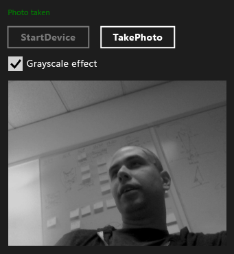

# Walkthrough: Creating a Windows Store app using WRL and Media Foundation
Learn how to use the [!INCLUDE[cppwrl](../vs140/includes/cppwrl_md.md)] ([!INCLUDE[cppwrl_short](../vs140/includes/cppwrl_short_md.md)]) to create a [!INCLUDE[win8_appname_long](../vs140/includes/win8_appname_long_md.md)] app that uses [Microsoft Media Foundation](http://msdn.microsoft.com/library/windows/apps/ms694197).  
  
 This example creates a custom Media Foundation transform that applies a grayscale effect to images that are captured from a webcam. The app uses C++ to define the custom transform and C# to use the component to transform the captured images.  
  
> [!NOTE]
>  Instead of C#, you can also use JavaScript, Visual Basic, or C++ to consume the custom transform component.  
  
 In most cases, you can use [!INCLUDE[cppwrt](../vs140/includes/cppwrt_md.md)] ([!INCLUDE[cppwrt_short](../vs140/includes/cppwrt_short_md.md)]) to create [!INCLUDE[wrt](../vs140/includes/wrt_md.md)] components. (For more information, see [Visual C++ Language Reference (C++/CX)](assetId:///3f6abf92-4e5e-4ed8-8e11-f9252380d30a).) However, sometimes you have to use the [!INCLUDE[cppwrl_short](../vs140/includes/cppwrl_short_md.md)]. For example, when you create a media extension for Microsoft Media Foundation, you must create a component that implements both COM and [!INCLUDE[wrt](../vs140/includes/wrt_md.md)] interfaces. Because [!INCLUDE[cppwrt_short](../vs140/includes/cppwrt_short_md.md)] can only create [!INCLUDE[wrt](../vs140/includes/wrt_md.md)] objects, to create a media extension you must use the [!INCLUDE[cppwrl_short](../vs140/includes/cppwrl_short_md.md)] because it enables the implementation of both COM and [!INCLUDE[wrt](../vs140/includes/wrt_md.md)] interfaces.  
  
> [!NOTE]
>  Although this code example is long, it demonstrates the minimum that's required to create a useful Media Foundation transform. You can use it as a starting point for your own custom transform. This example is adapted from the [Media extensions sample](http://code.msdn.microsoft.com/windowsapps/Media-extensions-sample-7b466096), which uses media extensions to apply effects to video, decode video, and create scheme handlers that produce media streams.  
  
## Prerequisites  
  
-   Experience with the [Windows Runtime](http://msdn.microsoft.com/library/windows/apps/br211377.aspx).  
  
-   Experience with COM.  
  
-   A webcam.  
  
## Key points  
  
-   To create a custom Media Foundation component, use a Microsoft Interface Definition Language (MIDL) definition file to define an interface, implement that interface, and then make it activatable from other components.  
  
-   The `namespace` and `runtimeclass` attributes, and the `NTDDI_WIN8`[version](assetId:///66ac5cf3-2230-44fd-aaf6-8013e4a4ae81) attribute value are important parts of the MIDL definition for a Media Foundation component that uses [!INCLUDE[cppwrl_short](../vs140/includes/cppwrl_short_md.md)].  
  
-   [Microsoft::WRL::RuntimeClass](../vs140/RuntimeClass-Class.md) is the base class for the custom Media Foundation component. The [Microsoft::WRL::RuntimeClassType::WinRtClassicComMix](../vs140/RuntimeClassType-Enumeration.md) enum value, which is provided as a template argument, marks the class for use both as a [!INCLUDE[wrt](../vs140/includes/wrt_md.md)] class and as a classic COM runtime class.  
  
-   The [InspectableClass](../vs140/InspectableClass-Macro.md) macro implements basic COM functionality such as reference counting and the `QueryInterface` method, and sets the runtime class name and trust level.  
  
-   Use the [Microsoft::WRL::Module](../vs140/Module-Class.md) class to implement DLL entry-point functions such as [DllGetActivationFactory](http://msdn.microsoft.com/library/br205771.aspx), [DllCanUnloadNow](http://msdn.microsoft.com/library/windows/desktop/ms690368\(v=vs.85\).aspx), and [DllGetClassObject](http://msdn.microsoft.com/library/windows/desktop/ms680760\(v=vs.85\).aspx).  
  
-   Link your component DLL to runtimeobject.lib. Also specify [/WINMD](assetId:///ecfadce8-3a3f-40cc-bb01-b4731f8d2fcb) on the linker line to generate Windows metadata.  
  
-   Use project references to make [!INCLUDE[cppwrl_short](../vs140/includes/cppwrl_short_md.md)] components accessible to [!INCLUDE[win8_appname_long](../vs140/includes/win8_appname_long_md.md)] apps.  
  
### To use the [!INCLUDE[cppwrl_short](../vs140/includes/cppwrl_short_md.md)] to create the Media Foundation grayscale transform component  
  
1.  In Visual Studio, create a **Blank Solution** project. Name the project, for example, `MediaCapture`.  
  
2.  Add a **DLL (Windows Store apps)** project to the solution. Name the project, for example, `GrayscaleTransform`.  
  
3.  Add a **Midl File (.idl)** file to the project. Name the file, for example, `GrayscaleTransform.idl`.  
  
4.  Add this code to GrayscaleTransform.idl.  
  
     [!CODE [wrl-media-capture#1](../CodeSnippet/VS_Snippets_Misc/wrl-media-capture#1)]  
  
5.  Use the following code to replace the contents of pch.h.  
  
     [!CODE [wrl-media-capture#2](../CodeSnippet/VS_Snippets_Misc/wrl-media-capture#2)]  
  
6.  Add a new header file to the project, name it `BufferLock.h`, and then add this code:  
  
     [!CODE [wrl-media-capture#3](../CodeSnippet/VS_Snippets_Misc/wrl-media-capture#3)]  
  
7.  GrayscaleTransform.h is not used in this example. You can remove it from the project if you want to.  
  
8.  Use the following code to replace the contents of GrayscaleTransform.cpp.  
  
     [!CODE [wrl-media-capture#4](../CodeSnippet/VS_Snippets_Misc/wrl-media-capture#4)]  
  
9. Add a new module-definition file to the project, name it `GrayscaleTransform.def`, and then add this code:  
  
     [!CODE [wrl-media-capture#5](../CodeSnippet/VS_Snippets_Misc/wrl-media-capture#5)]  
  
10. Use the following code to replace the contents of dllmain.cpp.  
  
     [!CODE [wrl-media-capture#6](../CodeSnippet/VS_Snippets_Misc/wrl-media-capture#6)]  
  
11. In the project’s **Property Pages** dialog box, set the following **Linker** properties.  
  
    1.  Under **Input**, for the **Module Definition File**, specify `GrayScaleTransform.def`.  
  
    2.  Also under **Input**, add `runtimeobject.lib`, `mfuuid.lib`, and `mfplatf.lib` to the **Additional Dependencies** property.  
  
    3.  Under **Windows Metadata**, set **Generate Windows Metadata** to **Yes (/WINMD)**.  
  
### To use the [!INCLUDE[cppwrl_short](../vs140/includes/cppwrl_short_md.md)] the custom Media Foundation component from a C# app  
  
1.  Add a new **C# Blank App (XAML)** project to the `MediaCapture` solution. Name the project, for example, `MediaCapture`.  
  
2.  In the **MediaCapture** project, add a reference to the `GrayscaleTransform` project. To learn how, see [How to: Add or Remove References By Using the Reference Manager](../vs140/How-to--Add-or-Remove-References-By-Using-the-Reference-Manager.md).  
  
3.  In Package.appxmanifest, on the **Capabilities** tab, select **Microphone** and **Webcam**. Both capabilities are required to capture photos from the webcam.  
  
4.  In MainPage.xaml, add this code to the root [Grid](http://msdn.microsoft.com/library/windows/apps/xaml/windows.ui.xaml.controls.grid.aspx) element:  
  
     [!CODE [wrl-media-capture#7](../CodeSnippet/VS_Snippets_Misc/wrl-media-capture#7)]  
  
5.  Use the following code to replace the contents of MainPage.xaml.cs.  
  
     [!CODE [wrl-media-capture#8](../CodeSnippet/VS_Snippets_Misc/wrl-media-capture#8)]  
  
 The following illustration shows the MediaCapture app.  
  
   
  
## Next Steps  
 The example shows how to capture photos from the default webcam one at a time. The [Media extensions sample](http://code.msdn.microsoft.com/windowsapps/Media-extensions-sample-7b466096) does more. It demonstrates how to enumerate webcam devices and work with local scheme handlers, and demonstrates additional media effects that work on both individual photos and streams of video.  
  
## See Also  
 [Windows Runtime C++ Template Library](../vs140/Windows-Runtime-C---Template-Library--WRL-.md)   
 [Microsoft Media Foundation](http://msdn.microsoft.com/library/windows/apps/ms694197)   
 [Media extensions sample](http://code.msdn.microsoft.com/windowsapps/Media-extensions-sample-7b466096)