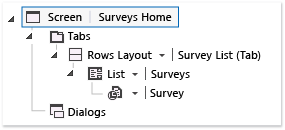
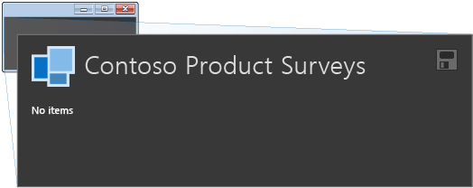
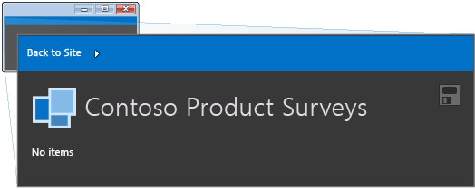

# Walkthrough: Creating an App for SharePoint by Using LightSwitch
By using LightSwitch, you can create an app for SharePoint in which mobile users can view, add, and update SharePoint data from remote locations by using modern, touch-oriented devices such as phones and tablets. In this walkthrough, you'll create an app in which sales representatives for a fictitious food distributor, Contoso Foods, can enter survey data about how partner stores display their products.  
  
 These representatives frequently visit each location to deliver products and conduct quality surveys that measure the presence that each product has within the store. During the survey, representatives typically collect the following kinds of data:  
  
-   Cleanliness of the display (ranging from “very poor” to “excellent”).  
  
-   Lighting of the product (also ranging from “very poor” to “excellent”).  
  
-   Aisle location of the product (middle of the aisle, end of the aisle, or aisle end-cap).  
  
-   Shelf height of the product (top shelf, eye-level shelf, or bottom shelf).  
  
 Representatives also photograph the product displays to support the overall assessments.  
  
## Prerequisites  
 This walkthrough requires [!INCLUDE[vs_dev12](../vs140/includes/vs_dev12_md.md)].  
  
 You’ll also need the sample files in the download [Survey App Tutorial: Developing a SharePoint Application Using LightSwitch](http://go.microsoft.com/fwlink/?LinkId=269542).  
  
 To host the app, you must also have a SharePoint Developer site on Office 365, which you can get from the [Developer Center for Apps for Office and SharePoint](http://go.microsoft.com/fwlink/?LinkId=263490).  
  
## Create a LightSwitch App in HTML  
 To develop a LightSwitch app for SharePoint, you first create a client project in either Silverlight or HTML. For this walkthrough, you'll use HTML so that you can optimize the screens for mobile devices.  
  
#### To create the project  
  
1.  On the menu bar, choose **File**, **New**, **Project**.  
  
     The **New Project** dialog box opens.  
  
2.  In the list of templates, expand the **Visual Basic** or **Visual C#** node, choose the **LightSwitch** node, and then choose either **LightSwitch HTML Application (Visual Basic)** or **LightSwitch HTML Application (Visual C#)**.  
  
3.  In the **Name** text box, enter `SurveyApp`, and then choose the **OK** button.  
  
## Add Support for Displaying Survey Data  
 As representatives enter data, they must verify what they've entered and retrieve the data later. To add this functionality, start by adding a **Survey** entity in the intrinsic database that will store survey data, and then add a home screen to display the data. The home screen appears when a representative starts the app.  
  
#### To add the Survey entity  
  
1.  In **Solution Explorer**, open the shortcut menu for the **SurveyApp.Server** node, and then choose **Add Table**.  
  
     The **Entity Designer** appears.  
  
2.  In the **Properties** window, in the text box for the **Name** property, enter `Survey`.  
  
3.  In the **Entity Designer**, enter the following values:  
  
    |Name|Type|Required|  
    |----------|----------|--------------|  
    |SalesRepName|String|No|  
    |Cleanliness|Integer|Yes|  
    |Lighting|Integer|Yes|  
    |ShelfPlacement|Integer|Yes|  
    |AislePlacement|Integer|Yes|  
  
4.  Choose the **Cleanliness** field, and then, in the **Properties** window, choose the **Choice List** hyperlink.  
  
5.  In the **Choice List** dialog box, enter the following values, and then choose the **OK** button.  
  
    |Value|Display Name|  
    |-----------|------------------|  
    |0|Very Poor|  
    |1|Poor|  
    |2|Fair|  
    |3|Good|  
    |4|Excellent|  
  
6.  Choose the **Lighting** field, and then, in the **Properties** window, choose the **Choice List** hyperlink.  
  
7.  In the **Choice List** dialog box, enter the following values, and then choose the **OK** button.  
  
    |Value|Display Name|  
    |-----------|------------------|  
    |0|Very Poor|  
    |1|Poor|  
    |2|Fair|  
    |3|Good|  
    |4|Excellent|  
  
8.  Choose the **ShelfPlacement** field, and then, in the **Properties** window, choose the **Choice List** hyperlink.  
  
9. In the **Choice List** dialog box, enter the following values, and then choose the **OK** button.  
  
    |Value|Display Name|  
    |-----------|------------------|  
    |0|Top Shelf|  
    |1|Eye-Level Shelf|  
    |2|Bottom Shelf|  
  
10. Choose the **AislePlacement** field, and then, in the **Properties** window, choose the **Choice List** hyperlink.  
  
11. In the **Choice List** dialog box, enter the following values, and then choose the **OK** button.  
  
    |Value|Display Name|  
    |-----------|------------------|  
    |0|Middle of Aisle|  
    |1|End of Aisle|  
    |2|Aisle End-Cap|  
  
#### To create a home screen  
  
1.  In **Solution Explorer**, open the shortcut menu for the **SurveyApp.HTML Client** node, and then choose **Add Screen**.  
  
     The **Add New Screen** dialog box appears.  
  
2.  In the **Select a screen template** list, choose **Browse Data Screen**.  
  
3.  In the **Screen Name** text box, enter `SurveysHome`.  
  
4.  In the **Screen Data** list, choose **Surveys**, and then choose the **OK** button.  
  
5.  In the **Screen Designer**, choose the **Screen &#124; SurveysHome** node.  
  
       
  
6.  In the **Properties** window, choose the **Display Name** text box, and then enter `Contoso Product Surveys`.  
  
#### To test the app in a browser  
  
1.  On the menu bar, choose **Debug**, **Start Debugging**.  
  
     The app appears in your web browser and resembles the following illustration.  
  
       
  
     No survey items appear because you haven’t entered any data yet. Later, you’ll add a screen for both creating and editing survey data.  
  
2.  Close the browser window to stop the app from running.  
  
## Enable SharePoint Hosting  
 To create an app that representatives can start from a SharePoint site, you must enable hosting on SharePoint by modifying the settings of the HTML client project.  
  
> [!NOTE]
>  To host the app, you need a SharePoint Developer site on Office 365, which you can get from the [Developer Center for Apps for Office and SharePoint](http://go.microsoft.com/fwlink/?LinkId=263490).  
  
#### To enable SharePoint hosting  
  
1.  In **Solution Explorer**, choose the **SurveyApp** node.  
  
2.  On the menu bar, choose **Project**, **Enable SharePoint**.  
  
3.  In the **Enabling SharePoint** wizard, enter the URL for your Office 365 Developer site, and then choose the **Finish** button.  
  
     The URL should take the form https:// *MySite*.sharepoint.com/sites/Developer/.  
  
     References to several SharePoint assemblies are added to your LightSwitch project, and a project for a SharePoint web app is added to the solution.  
  
#### To test the hosted app  
  
1.  On the menu bar, choose **Debug**, **Start Debugging**.  
  
     The first time that you run a SharePoint app on your computer, you're prompted to install a Localhost certificate because LightSwitch apps that are enabled for SharePoint hosting always use SSL (Secure Sockets Layer). If you accept this certificate, a security warning won't appear each time that you launch the app. Because the certificate applies only to Localhost, your system faces no threat.  
  
2.  In the **Security Alert** dialog box, choose the **Yes** button.  
  
3.  If a **Security Warning** dialog box appears, choose the **Yes** button.  
  
     Your web browser appears.  
  
4.  On the **sign in** page, choose the **Sign In** button.  
  
5.  Enter your password, and then choose the **Sign In** button.  
  
6.  If prompted, choose the **Trust It** button.  
  
     The app appears in the browser and resembles the following illustration.  
  
       
  
     A bar appears at the top of the screen so that the user can navigate back to the SharePoint site. This SharePoint chrome bar appears on all apps for SharePoint.  
  
7.  Close the browser window to stop the app from running.  
  
## Add Support for Creating and Editing Survey Data  
 Now that you’ve incorporated SharePoint into your app, you can go back to adding functionality so that users can create and edit survey data. In this section, you’ll add a couple more entities by attaching to SharePoint lists, add relationships between the entities, modify the home screen, create a data entry screen, and hook up navigation for the new screen.  
  
#### To add entities  
  
1.  In a web browser, locate your SharePoint Developer site by using the same URL that you entered in the earlier procedure for enabling SharePoint.  
  
2.  On the Office 365 menu bar, choose the **Settings** icon, and then choose the **Site Settings** menu item.  
  
3.  In the **Web Designer Galleries** list, choose **List Templates**.  
  
4.  On the **Web Designer Gallery** page, on the menu bar, choose **Files**, **Upload Document**.  
  
5.  In the **Add a Template** dialog box, choose **browse**, locate the **contoso_customers_template.stp** template file that was included in the sample download, and then choose the **OK** button.  
  
6.  In the **List Template Gallery** dialog box, choose the **Save** button.  
  
7.  On the menu bar, choose **Files**, **Upload Document**.  
  
8.  In the **Add a Template** dialog box, choose **browse**, locate the **contoso_products_template.stp** template file that was included in the sample download, and then choose the **OK** button.  
  
9. In the **List Template Gallery** dialog box, choose the **Save** button.  
  
10. On the **Developer** menu bar, choose **Site Contents**, choose the **add an app** link, and then choose **Contoso Customers Template**.  
  
11. In the **Adding Custom List** dialog box, name the list `Customers`, and then choose the **Create** button.  
  
12. On the **Site Contents** page, choose the **add an app** link, and then choose **Contoso Products Template**.  
  
13. In the **Adding Custom List** dialog box, name the list `Products`, and then choose the **Create** button.  
  
14. In Visual Studio, in **Solution Explorer**, open the shortcut menu for the **SurveyApp.Server** node, and then choose **Add Data Source**.  
  
15. In the **Attach Data Source Wizard**, choose the **SharePoint** icon, and then choose the **Next** button.  
  
16. In the **Specify the SharePoint site address** text box, enter the URL for your SharePoint developer site, and then choose the **Next** button.  
  
17. In the **Select the entities to use in your application** list, expand the **List** node, select the **Customer** and **Products** check boxes, and then choose the **Finish** button.  
  
     The Customers, Products, and UserInformationList entities are added to the app.  
  
#### To create relationships between entities  
  
1.  In **Solution Explorer**, expand the **Data Sources** node, open the shortcut menu for the **Surveys.lsml** node, and then choose **Open**.  
  
2.  In the **Entity Designer**, on the toolbar, choose the **Relationship** link.  
  
     The **Add New Relationship** dialog box appears.  
  
3.  In the **To** column, in the **Name** list, choose **Customer**, and then choose the **OK** button.  
  
4.  In the **Entity Designer**, choose the **Relationship** link.  
  
5.  In the **Add New Relationship** dialog box, in the **To** column, in the **Name** list, choose **Product**, and then choose the **OK** button.  
  
#### To modify the home screen  
  
1.  In **Solution Explorer**, open the shortcut menu for the **SurveysHome.lsml** node, and then choose **Open**.  
  
2.  In the center pane of the Screen Designer, expand the list for the **Survey** node, and then choose **Rows Layout**.  
  
3.  Choose the **Sales Rep Name**,  **Cleanliness**,  **Lighting**, **Shelf Placement**, and **Aisle Placement** nodes, and then delete them.  
  
4.  In the **Add** list, choose **Customer**.  
  
5.  In the **Add** list, choose **Product**.  
  
#### To add a screen for creating and editing surveys  
  
1.  In the screen designer, expand the **Command Bar** node, and then choose **Add**.  
  
2.  In the **Add Button** dialog box, choose the **Choose an existing method** option button.  
  
3.  In the **showTab** list, choose **addAndEditNew**.  
  
4.  In the **Navigate To** list, choose **New Screen**, and then choose the **OK** button.  
  
     The **Add New Screen** dialog box opens  
  
5.  In the **Add New Screen** dialog box, accept the default values, and then choose the **OK** button.  
  
6.  In the Screen Designer, move the **Customer** and **Product** nodes so that they appear under the **Sales Rep Name** node.  
  
7.  Delete the **Rows Layout &#124; Right** node.  
  
#### To add screen navigation  
  
1.  In **Solution Explorer**, open the shortcut menu for the **Surveys Home.lsml** node, and then choose **Open**.  
  
2.  In the Screen Designer, choose the **List &#124; My Product Surveys** node.  
  
3.  In the **Properties** window, choose **the Item Tap: None** hyperlink.  
  
     The **Edit ItemTap Action** dialog box opens.  
  
4.  In the **showTab** list, choose **editSelected**.  
  
5.  In the **Navigate To** list, choose **Add Edit Survey**, and then choose the **OK** button.  
  
#### To test the changes  
  
1.  On the menu bar, choose **Debug**, **Start Debugging**.  
  
2.  On the home screen, choose the **Add Survey** button.  
  
     The **Add Edit Survey** screen appears.  
  
3.  Expand the **Customer** list to display sample customer data.  
  
4.  Expand the **Product** list to display sample product data.  
  
5.  Expand each of the remaining lists to display the choices that you entered earlier in this walkthrough.  
  
6.  Close the browser window to stop the app from running.  
  
## Add Logic for Sales Rep Name  
 Sales representatives shouldn’t have to enter their names each time that they create a survey. Next you’ll add logic to automatically populate the **Sales Rep Name** field with the name of the current authenticated user and to show only the surveys that each representative created.  
  
#### To set a default value  
  
1.  In **Solution Explorer**, open the shortcut menu for the **Surveys.lsml** node, and then choose **Open**.  
  
     The Entity Designer opens.  
  
2.  In the **Write Code** list, choose **Surveys_Inserting**.  
  
3.  In the Code Editor, add the following code to the **Surveys_Inserting** method:  
  
    ```vb  
    entity.SalesRepName = Application.User.Name  
    ```  
  
    ```c#  
    entity.SalesRepName = this.Application.User.Name;  
    ```  
  
     This method runs within the server’s save pipeline whenever a **Survey** entity is inserted. When the app retrieves user information, it corresponds to the user who's signed in to SharePoint.  
  
4.  In **Solution Explorer**, open the shortcut menu for the **AddEditSurvey.lsml** node, and then choose **Open**.  
  
     The **Screen Designer** opens.  
  
5.  In the center pane, delete the **Sales Rep Name** node.  
  
#### To add filtering logic  
  
1.  In **Solution Explorer**, open the shortcut menu for the **Surveys.lsml** node, and then choose **Open**.  
  
     The Entity Designer opens.  
  
2.  In the **Write Code** list, choose **Surveys_Filter**.  
  
3.  In the Code Editor, add the following code to the **Surveys_Filter** method:  
  
    ```vb  
    filter = Function(e) e.SalesRepName = Application.User.Name  
    ```  
  
    ```c#  
    filter = f => f.SalesRepName == this.Application.User.Name;  
    ```  
  
     This method runs on the server whenever the **Survey** entity is queried.  
  
#### To test the changes  
  
1.  On the menu bar, choose **Debug**, **Start Debugging**.  
  
2.  On the home screen, choose the **Add Survey** button.  
  
3.  In the **Customer** list, choose a customer.  
  
4.  In the **Product** list, choose a product.  
  
5.  In each of the remaining lists, choose a value, and then choose the **Save** button.  
  
6.  Verify that the list of surveys contains the survey that you just created.  
  
7.  Close the browser window to stop the app from running.  
  
## Add Logic for Date of Most Recent Survey  
 Next you’ll add code to reflect the date on which a survey was most recently conducted on each customer’s site.  
  
#### To update the date of the most recent survey  
  
1.  In **Solution Explorer**, open the shortcut menu for the **Surveys.lsml** node, and then choose **Open**.  
  
2.  In the **Write Code** list, choose **Surveys_Inserted**.  
  
3.  In the Code Editor, add the following code to the **Surveys_Inserted** method:  
  
    ```vb  
    Dim c As Customer = Me.DataWorkspace.DeveloperData.Customers.Where(  
                    Function(f) f.CompanyName = entity.Customer.CompanyName).FirstOrDefault()  
                If (Not c Is Nothing) Then  
                    c.LastSurveyDate = Date.Today  
                    Me.DataWorkspace.DeveloperData.SaveChanges()  
                End If  
    ```  
  
    ```c#  
    Customer c = this.DataWorkspace.DeveloperData.Customers.Where(f =>  
     f.CompanyName == entity.Customer.CompanyName).FirstOrDefault();  
  
                if (c != null)  
                {  
                    c.LastSurveyDate = DateTime.Today;  
                    this.DataWorkspace.DeveloperData.SaveChanges();  
                }  
    ```  
  
#### To test the changes  
  
1.  On the menu bar, choose **Debug**, **Start Debugging**.  
  
2.  On the home screen, choose the **Add Survey** button.  
  
3.  In the **Customer** list, choose a customer.  
  
4.  In the **Product** list, choose a product.  
  
5.  In each of the remaining lists, choose a value, and then choose the **Save** button.  
  
6.  Verify that the list of surveys contains the survey that you just created.  
  
7.  On the menu bar, choose **Back to Site**.  
  
     Your SharePoint Developer site appears. In the **Customers** list, the **LastSurveyDate** has been updated for the customer that you just surveyed.  
  
8.  Close the browser window to stop the app from running.  
  
## Update the Splash Screen and the Title Bar  
 Next you’ll update the splash screen, which appears while the app is starting, to display the app name instead of the project name. You’ll also modify the name that appears in the title bar or browser tab.  
  
#### To update the display strings  
  
1.  In **Solution Explorer**, expand the **SurveyApp.HTMLClient** node, open the shortcut menu for the **default.htm** file, and then choose **Open**.  
  
2.  In the Code Editor, locate the `<div>` element and then replace `SurveyApp` with `Contoso Product Surveys`.  
  
     This string will appear on the splash screen.  
  
3.  In the <title\> element, replace `SurveyApp` with `Contoso Product Surveys`.  
  
#### To test the changes  
  
1.  On the menu bar, choose **Debug**, **Start Debugging**.  
  
     Notice that Contoso Product Surveys appears on the splash screen and in the title bar.  
  
2.  Close the browser window to stop the app from running.  
  
## Add Support for Uploading and Displaying Photos  
 Next you’ll add support for uploading photos to a SharePoint Picture Library. When a sales representative uploads a photo, SharePoint will automatically create a thumbnail of that photo and a version that's optimized for the web. These additional images will help sales representatives browse and manage images faster and more easily in SharePoint than in the SQL database for LightSwitch.  
  
 Apps for SharePoint may include a variety of assets such as lists, modules, content types, and property bags that reside in the app web and that are installed and removed as part of the app.  
  
#### To add a Photo entity  
  
1.  In **Solution Explorer**, open the shortcut menu for the **SurveyApp.Server** node, and then choose **Add Table**.  
  
2.  In the **Properties** window, in the **Name** text box, enter `Photo`.  
  
3.  In the Entity Designer, enter the following values:  
  
    |Name|Type|Required|  
    |----------|----------|--------------|  
    |FullImageUrl|Web Address|Yes|  
    |ThumbnailUrl|Web Address|Yes|  
    |OptimizedUrl|Web Address|Yes|  
    |NameWithExt|String|Yes|  
    |CreatedDate|Date Time|Yes|  
  
#### To add a relationship  
  
1.  In **Solution Explorer**, open the shortcut menu for the **Surveys.lsml** node, and then choose **Open**.  
  
2.  In the **Entity Designer**, on the toolbar, choose the **Relationship** link.  
  
3.  In the **Add New Relationship** dialog box, in the **Name** row and **To** column, choose **Photo** in the list.  
  
4.  In the **Multiplicity** row and the **From** column, choose **One** in the list.  
  
5.  In the **Multiplicity** row and the **To** column, choose **Many** in the list.  
  
6.  In the **On Delete Behavior** row and the **From** column, choose **Cascade delete** in the list, and then choose the **OK** button.  
  
#### To add a SharePoint picture library  
  
1.  In **Solution Explorer**, open the shortcut menu for the **SurveyApp.SharePoint** node, choose **Add**, and then choose **New Item**.  
  
2.  In the **Add New Item** dialog box, choose **List**.  
  
3.  In the **Name** text box, enter `Photos`, and then choose the **Add** button.  
  
4.  In the **SharePoint Customization Wizard**, choose the **Create a list based on an existing list template** option button.  
  
5.  In the **Announcements** list, choose **Picture Library**, and then choose the **Finish** button.  
  
#### To add a utility class  
  
1.  In **Solution Explorer**, open the shortcut menu for the **SurveyApp.Server** node, choose **Add**, and then choose **Existing Item**.  
  
     The **Add Existing Item** dialog box opens.  
  
2.  Locate the **PhotoListHelper.vb** or **PhotoListHelper.cs** file that you downloaded as a part of the sample, and then choose the **Add** button.  
  
3.  In the Code Editor, in the `AddPhoto` method, locate the line `siteContext.ExecuteQuery()`, and then add the following code:  
  
    ```vb  
    siteContext.Load(siteContext.Web)  
    siteContext.ExecuteQuery()  
  
    ```  
  
    ```c#  
    siteContext.Load(siteContext.Web);  
    siteContext.ExecuteQuery();  
  
    ```  
  
    > [!NOTE]
    >  This additional code is necessary in [!INCLUDE[vs_dev12](../vs140/includes/vs_dev12_md.md)] to prevent an exception on subsequent calls to the URL.  
  
4.  On the menu bar, choose **Build**, **Build Solution** to ensure that the code compiles correctly.  
  
#### To add a WebAPI controller  
  
1.  In **Solution Explorer**, open the shortcut menu for the **SurveyApp.Server** node, choose **Add**, and then choose **New Item**.  
  
2.  In the **Add New Item** dialog box, choose the **Web** node, and then choose the **Web API Controller Class** template.  
  
3.  In the **Name** text box, enter `PhotosController`, and then choose the **Add** button.  
  
4.  In the Code Editor, replace the contents with the following code:  
  
    ```vb  
    Imports System.Net  
    Imports System.Web.Http  
    Imports LightSwitchApplication  
    Imports Microsoft.SharePoint.Client  
    Imports System.IO  
    Imports System.Net.Http  
    Imports System.Net.Http.Headers  
    Imports System.Text  
    Imports System.Threading.Tasks  
  
    Public Class PhotosController  
        Inherits ApiController  
  
    Private _appWebContext As ClientContext  
        Private ReadOnly Property AppWebContext() As ClientContext  
            Get  
                If _appWebContext Is Nothing Then  
                    Using serverContext = LightSwitchApplication.ServerApplicationContext.CreateContext()  
                        _appWebContext = serverContext.Application.SharePoint.GetAppWebClientContext()  
                    End Using  
                End If  
                Return _appWebContext  
            End Get  
        End Property  
        Public Function PostFormData() As Task(Of HttpResponseMessage)  
            If Not Request.Content.IsMimeMultipartContent() Then  
                Throw New HttpResponseException(HttpStatusCode.UnsupportedMediaType)  
            End If  
            Dim memStream = New MultipartMemoryStreamProvider()  
            Dim spCtx = AppWebContext  
            Dim myTask = Request.Content.ReadAsMultipartAsync(memStream).ContinueWith(  
              Function(t)  
                      If t.IsFaulted OrElse t.IsCanceled Then  
                          Request.CreateErrorResponse(HttpStatusCode.InternalServerError, t.Exception)  
                      End If  
                      Dim fileList = New StringBuilder()  
                      For Each contentItem In memStream.Contents  
                          Dim sourceFileName = Path.GetFileName(contentItem.Headers.ContentDisposition.FileName.Replace("""", ""))  
                          Try  
                              Dim fileReadTask = contentItem.ReadAsByteArrayAsync().ContinueWith(  
                                  Function(frt)  
                                    Dim photoUrl = PhotoListHelper.AddPhoto(frt.Result, sourceFileName, spCtx)  
                                    Return photoUrl  
                                End Function  
                              )  
                              fileReadTask.Wait()  
                              fileList.AppendLine(fileReadTask.Result)  
                          Catch ex As Exception  
                              fileList.AppendLine("FAILED::" + ex.Message)  
                          End Try  
                      Next  
                      Return Request.CreateResponse(HttpStatusCode.Created, fileList.ToString(), New MediaTypeHeaderValue("application/xml"))  
                  End Function  
            )  
            Return myTask  
  
        End Function  
        Public Function DeletePhoto(url As String) As Task(Of HttpResponseMessage)  
            Dim spCtx = AppWebContext  
            Dim deleteTask = New Task(Of HttpResponseMessage)(  
                Function()  
                        Try  
                            PhotoListHelper.DeletePhoto(url, spCtx)  
                            Return Request.CreateResponse(HttpStatusCode.OK)  
                        Catch ex As Exception  
                            Return Request.CreateErrorResponse(HttpStatusCode.NotModified, ex)  
                        End Try  
                    End Function  
            )  
            deleteTask.Start()  
            Return deleteTask  
        End Function  
    End Class  
    ```  
  
    ```c#  
    using System;  
    using System.Collections;  
    using System.Collections.Generic;  
    using System.Data;  
    using System.Diagnostics;  
    using System.Net;  
    using System.Web.Http;  
    using LightSwitchApplication;  
    using Microsoft.SharePoint.Client;  
    using System.IO;  
    using System.Net.Http;  
    using System.Net.Http.Headers;  
    using System.Text;  
    using System.Threading.Tasks;  
  
    public class PhotosController : ApiController  
    {  
  
    private ClientContext appWebContext;  
    private ClientContext AppWebContext  
            {  
                get  
                {  
                    if (appWebContext == null)  
                    {  
                        using (var serverContext = LightSwitchApplication. ServerApplicationContext.CreateContext())  
                        {  
                            appWebContext = serverContext.Application.SharePoint.GetAppWebClientContext();  
                        }  
                    }  
                    return appWebContext;  
                }  
            }  
  
            public Task<HttpResponseMessage> PostFormData()  
            {  
                if (!Request.Content.IsMimeMultipartContent())  
                {  
                    throw new HttpResponseException(HttpStatusCode.UnsupportedMediaType);  
                }  
  
                    // Since we're uploading the image to Sharepoint directly, we'll just read the Http content into memory  
                    var memoryStream = new MultipartMemoryStreamProvider();  
                    // We need to get the appweb context before forking the new task; otherwise the LightSwitch runtime will   
                    // throw because there is no HttpContext available on the calling thread.  
                    var sharepointContext = this.AppWebContext;  
                    var task = Request.Content.ReadAsMultipartAsync(memoryStream).  
                        ContinueWith<HttpResponseMessage>(t =>  
                        {  
                            if (t.IsFaulted || t.IsCanceled)  
                            {  
                                Request.CreateErrorResponse(HttpStatusCode.InternalServerError, t.Exception);  
                            }  
  
                            // There can be multiple files in the POST, so we'll upload each attachment and attach its new  
                            // URL (in the SP Picture Library).  
                            StringBuilder fileList = new StringBuilder();  
                            foreach (var contentItem in memoryStream.Contents)  
                            {  
  
                                var sourceFileName = Path.GetFileName(contentItem.Headers.ContentDisposition.FileName.Replace("\"", ""));  
                                try  
                                {  
                                    // Read the contents of the file into memory and upload it to Sharepoint  
                                    var fileReadTask = contentItem.ReadAsByteArrayAsync().  
                                        ContinueWith<string>(frt =>  
                                        {  
                                            var photoURL = PhotoListHelper.AddPhoto(frt.Result, sourceFileName, sharepointContext);  
                                            return photoURL;  
                                        });  
                                    fileReadTask.Wait();  
                                    fileList.AppendLine(fileReadTask.Result);  
                                }  
                                catch (Exception ex)  
                                {  
                                    fileList.AppendLine(@"FAILED::" + ex.Message);  
                                }  
                            }  
                            return Request.CreateResponse(HttpStatusCode.Created, fileList.ToString(), new MediaTypeHeaderValue("application/xml"));  
                        });  
                    return task;  
  
            }  
  
            public Task<HttpResponseMessage> DeletePhoto(string url)  
            {  
                var sharepointContext = this.AppWebContext;  
  
                var deleteTask = new Task<HttpResponseMessage>(  
                    () =>  
                    {  
                        try  
                        {  
                            PhotoListHelper.DeletePhoto(url, sharepointContext);  
                            return Request.CreateResponse(HttpStatusCode.OK);  
                        }  
                        catch (Exception e)  
                        {  
                            return Request.CreateErrorResponse(HttpStatusCode.NotModified, e);  
                        }  
                    });  
                deleteTask.Start();  
                return deleteTask;  
            }  
    }  
  
    ```  
  
     Notice that this code retrieves the `SharePoint` host object by using the server API for LightSwitch: `appWebContext = serverContext.Application.SharePoint.GetAppWebClientContext()`. The `SharePoint` host object provides access to several useful properties and methods that are used to interact with the SharePoint site. In particular, the `GetAppWebClientContext` method provides an entry point for interacting with assets that belong to the app web. When the app web’s **ClientContext** is retrieved, the proper context token is used for communicating back into SharePoint.  
  
#### To add an HTTP route to the controller  
  
1.  In **Solution Explorer**, open the shortcut menu for the **SurveyApp.Server** node, choose **Add**, and then choose **New Item**.  
  
2.  In the **Add New Item** dialog box, choose the **Web** node, and then choose the **Global Application Class** template.  
  
3.  In the **Name** text box, enter `Global.asax`, and then choose the **Add** button.  
  
4.  In the Code Editor, enter the following `Imports` or `Using` statements:  
  
    ```vb  
    Imports System.Web.Routing  
    Imports System.Web.Http  
    ```  
  
    ```c#  
    using System.Web.Routing;  
    using System.Web.Http;  
    ```  
  
     Add the following code to the `Application_Start` method:  
  
    ```vb  
    RouteTable.Routes.MapHttpRoute(  
           name := "DefaultApi",  
          routeTemplate := "api/{controller}/{id}",  
          defaults := New With { .id = System.Web.Http.RouteParameter.Optional }  
      )  
    ```  
  
    ```c#  
    RouteTable.Routes.MapHttpRoute(  
                               name: "DefaultApi",  
                               routeTemplate: "api/{controller}/{id}",  
                               defaults: new { id = System.Web.Http.RouteParameter.Optional }  
                               );  
        }  
    ```  
  
     The HTTP route enables the controller to be invoked from the client.  
  
5.  On the menu bar, choose **Build**, **Build Solution** to ensure that the code compiles correctly.  
  
## Authenticate the App to Interact with the Photos Picture Library  
 The app web, which contains the **Photos** Picture Library, resides in an isolated domain. By default, your app isn’t authenticated to interact with the app web, so you must add a simple script to perform that authentication.  
  
#### To add authentication  
  
1.  In **Solution Explorer**, expand the **SurveyApp.HTMLClient** node, open the shortcut menu for the **Scripts** node, choose **Add**, and then choose **Existing Item**.  
  
2.  In the **Add Existing Item** dialog box, locate the **sharepointauthhelper.js** file that you downloaded as a part of the sample, and then choose the **Add** button.  
  
3.  In the code editor, replace the contents with the following code:  
  
    ```javascript  
    $(document).ready(function () {  
    var paramName = "SPAppWebUrl";  
    var match = RegExp('[?&]' + paramName + '=([^&]*)')  
    .exec(window.location.search);  
    var appWebUrl = match && decodeURIComponent(match[1].replace(/\+/g, ' '));  
    if (appWebUrl) {  
    var authproxy = appWebUrl + "/_layouts/15/appwebproxy.aspx"  
    var iframe = $("<iframe src='" + authproxy + "' style='width: 0px; height: 0px; border: 0px'/>");  
    $("body").append(iframe);  
    }  
    });  
  
    ```  
  
    > [!NOTE]
    >  In [!INCLUDE[vs_dev12](../vs140/includes/vs_dev12_md.md)], authentication for SharePoint apps uses a query string instead of a cookie to pass the URL.  
  
4.  In **Solution Explorer**, open the shortcut menu for the **default.htm** file, and then choose **Open**.  
  
5.  In the default.htm file, add the following reference:  
  
    ```html  
    <script type="text/javascript" src="Scripts/sharepointauthhelper.js"></script  
    ```  
  
6.  On the menu bar, choose **Build**, **Build Solution** to ensure that the code compiles correctly.  
  
## Add a Custom Control for Uploading Photos  
 Next you’ll create a custom control that will prompt sales representatives to upload photos of each product display.  
  
#### To create the custom control  
  
1.  In **Solution Explorer**, expand the **SurveyApp.HTMLClient** node, open the shortcut menu for the **Scripts** node, choose **Add**, and then choose **Existing Item**.  
  
2.  In the **Add Existing Item** dialog box, locate the **photohelper.js** file that you downloaded as a part of the sample, and then choose the **Add** button.  
  
3.  In **Solution Explorer**, open the shortcut menu for the **default.htm** file, and then choose **Open**.  
  
4.  In the Code Editor, add the following reference:  
  
    ```html  
    <script type="text/javascript" src="Scripts/photohelper.js"></script>  
    ```  
  
5.  In **Solution Explorer**, on the toolbar, choose **Logical View** in the list.  
  
6.  Open the shortcut menu for the **AddEditSurvey.lsml** screen node, and then choose **Open**.  
  
7.  In the Screen Designer, open the shortcut menu for the **Popups** node, and then choose **Add Popup**.  
  
8.  In the **Properties** window, in the **Name** text box, enter `UploadPhotos`.  
  
9. In the Screen Designer, under the **Rows Layout &#124; Upload Photos** node, expand the **Add** node, and then choose **New Custom Control**.  
  
     The **Add Custom Control** dialog box appears.  
  
10. Choose the **OK** button to accept the default value of `Screen` and close the dialog box.  
  
11. In the **Properties** window, in the **Name** text box, enter **UploadControl**, and then choose the **Edit Render Code** hyperlink.  
  
12. In the **Code Editor**, enter the following line of code above the myapp.AddEditSurvey.UploadControl_render method:  
  
    ```javascript  
    var $uploadControlElement, uploadControlContentItem;  
    ```  
  
     Add the following code to the body of the method:  
  
    ```javascript  
    $uploadControlElement = $(element);  
        uploadControlContentItem = contentItem;  
    ```  
  
     When a sales representative uploads a photo, this code will create a **Photo** entity in the intrinsic database that has property references to the full-sized, optimized, and thumbnail image URLs in the Picture Library. This entity will be used in a later step to display the images in the survey app.  
  
13. In **Solution Explorer**, open the shortcut menu for the **AddEditSurvey.lsml** screen node, and then choose **Open**.  
  
14. In the Screen Designer, open the shortcut menu for the **Rows Layout &#124; Upload Photos** node, and then choose **Add Button**.  
  
15. In the **Add Button** dialog box, choose the **Write my own method** option button.  
  
16. Name the method `UploadPhoto`, and then choose the **OK** button.  
  
17. In the **Screen Designer**, open the shortcut menu for the **Upload Photo** node, and then choose **Edit Execute Code**.  
  
18. In the Code Editor, add the following code to the `Upload` method:  
  
    ```javascript  
    if ($("#fileInput").val() != "") {  
            $.mobile.loading('show');  
            $("#uploadForm").submit();  
        }  
  
    ```  
  
     This code runs when the user taps the **Upload Photo** button on the **UploadControl**.  
  
19. In the Screen Designer, open the shortcut menu for the **Tabs** node, and then choose **Add Tab**.  
  
20. In the **Properties** window, name the tab `Photos`.  
  
21. Below the **Rows Layout &#124; Photos** node, open the shortcut menu for the **Command Bar** node, and then choose **Add Button**.  
  
22. In the **Add Button** dialog box, choose the **Write my own method** option button, name the method `UploadPhotos`, and then choose the **OK** button.  
  
23. In the **Properties** window, enter `Upload Photos` as the display name.  
  
24. In the **Icon** list, choose **Add Picture**.  
  
25. In the **Screen Designer**, open the shortcut menu for the **Upload Photos** node, and then choose **Edit Execute Code**.  
  
26. In the Code Editor, add the following code:  
  
    ```javascript  
    showUploadPopup(screen);  
    ```  
  
     This code displays the Popup information when the user taps the **Upload Photos** button.  
  
27. On the menu bar, choose **Build**, **Build Solution** to ensure that the code compiles correctly.  
  
## Add Screen Support for Displaying Photos  
 Next you’ll add support for displaying photos on the **AddEditSurvey** screen. A thumbnail image will appear for each photo, and then, when a sales representative chooses the thumbnail, the larger, web-optimized image will appear in a dialog box. In addition, You’ll add support for deleting photos when a sales representative deletes the survey records for those photos.  
  
#### To display a thumbnail image  
  
1.  In **Solution Explorer**, open the shortcut menu for the **AddEditSurvey.lsml** screen node, and then choose **Open**.  
  
2.  In the left pane of the Screen Designer, choose the **Add Photos** hyperlink.  
  
     The **Photos** query is added to the screen.  
  
3.  In the center pane of the Screen Designer, in the **Add** list for the **Rows Layout &#124; Photos** node, choose **Photos**.  
  
4.  In the **List** list, choose **Tile List**.  
  
5.  Delete the **Full Image Url**, **Optimized Url**, **Name With Ext**, **Created Date**, and **Survey** nodes.  
  
     Only the **Thumbnail Url** node should remain.  
  
6.  In the list for the **Thumbnail Url** node, choose **Image**.  
  
7.  In the **Properties** window, under **Width**, in the **Pixels** text box, enter `60`.  
  
8.  Under **Height**, in the **Pixels** text box, enter `60`.  
  
#### To add a popup  
  
1.  In the Screen Designer, choose the **Popups** node, and then choose **Add Popup**.  
  
2.  In the **Properties** window, in the **Name** text box, enter `ViewPhotoDetails`.  
  
3.  In left pane of the Screen Designer, move the **Name With Ext** node so that it appears under the **Rows Layout &#124; View Photo Details** node.  
  
4.  In the list for the **Name With Ext** node, choose **Text**.  
  
5.  Move the **Created Date** node so that it appears under the **Name With Ext** node.  
  
6.  In the list for the **Created Date** node, choose **Text**.  
  
7.  Move the **Optimized Url** node so that it appears under the **Created Date** node.  
  
8.  In the list for the **Optimized Url** node, choose **Image**.  
  
9. In the **Properties** window, in the **Width** list, choose **Fit to Content**.  
  
10. In the **Height** list, choose **Fit to Content**.  
  
11. In the **Label Position** list, choose **None**.  
  
12. In the Screen Designer, choose the **Tile List &#124; Photos** node.  
  
13. In the **Properties** window, choose the **Item Tap** hyperlink.  
  
     The **Edit ItemTap Action** dialog box appears.  
  
14. In the **Popup** list, choose **View Photo Details**, and then choose the **OK** button.  
  
#### To add support for deleting photos  
  
1.  In **Solution Explorer**, open the shortcut menu for the **Photos.lsml** node, and then choose **Open**.  
  
     The Entity Designer opens.  
  
2.  In the **Write Code** list, choose **Photos_Deleted**.  
  
3.  In the Code Editor, add the following code to the `Photos_Deleted` method:  
  
    ```vb  
    Try  
                    PhotoListHelper.DeletePhoto(entity.FullImageUrl, Application.SharePoint.GetAppWebClientContext())  
                Catch ex As Exception  
                End Try  
    ```  
  
    ```c#  
    try  
                {  
                    PhotoListHelper.DeletePhoto(entity.FullImageUrl, Application.SharePoint.GetAppWebClientContext());  
                }  
                catch (Exception) { }  
    ```  
  
     The relationship between the **Photos** and **Surveys** entities was set to **Cascade Delete**, so the `Photos_Deleted` method is called when a survey record is deleted. This code calls the `DeletePhoto` method of the `PhotoListHelper` class to delete the photos from the SharePoint list.  
  
4.  In **Solution Explorer**, open the shortcut menu for the **AddEditSurvey.lsml** node, and then choose **Open**.  
  
5.  In the Screen Designer, open the shortcut menu for the **Rows Layout &#124; View Photo Details** node, and then choose **Add Button**.  
  
6.  In the **Add Button** dialog box, choose the **Write my own method** option button.  
  
7.  In the **Method** text box, enter `DeletePhoto`, and then choose the **OK** button.  
  
8.  Open the shortcut menu for the **Delete Photo** node, and then choose **Edit Execute Code**.  
  
9. In the Code Editor, add the following code to the `DeletePhoto_Execute` method:  
  
    ```javascript  
    deleteCurrentPhoto(screen);  
    ```  
  
     Because you added this JavaScript code, sales representatives can delete photos without deleting the associated survey.  
  
#### To test the changes  
  
1.  On the menu bar, choose **Debug**, **Start Debugging**.  
  
2.  On the home screen, choose the **Add** button.  
  
3.  In the **Customer** list, choose a customer.  
  
4.  In the **Product** list, choose a product.  
  
5.  In each of the remaining lists, choose a value, and then choose the **Save** button.  
  
6.  In the list of surveys, verify that the survey that you just created appears.  
  
7.  On the **Photos** tab, choose the **Upload Photos** button.  
  
8.  In the **Upload Photos** dialog box, choose the **Browse** button, browse to a photo on your local computer, and then choose the **Open** button.  
  
9. Choose the **Upload Photo** button, and then choose the thumbnail image that appears.  
  
     The **View Photo Image** dialog box appears and shows the full-size image.  
  
10. Choose the **Delete Photo** button, and that verify that the thumbnail has been removed.  
  
11. Close the browser window to stop the app from running.  
  
## Publish the Finished App to SharePoint  
 So far you’ve only run the app in Debug mode, which uses SharePoint to provide authentication and redirects to the local computer’s instance of IIS Express. Your app is now complete and you can publish it to an on-premises SharePoint site, to Microsoft Azure, or to a third-party hosting site.  After you publish your app, others can run it from SharePoint on their computers and mobile devices. See [How to: Publish a cloud business app to SharePoint](http://msdn.microsoft.com/library/office/dn632422.aspx).  
  
## See Also  
 [LightSwitch Apps for Sharepoint](../vs140/LightSwitch-Apps-for-SharePoint.md)