# Walkthrough: Creating the Vision Clinic Application in LightSwitch
This walkthrough demonstrates the end-to-end process of creating an application in LightSwitch. You’ll use many features of LightSwitch to create an application for a fictional vision clinic. The application includes capabilities for scheduling appointments and creating invoices.  
  
## Prerequisites  
 Download the PrescriptionContoso database from [MSDN Code Gallery](http://code.msdn.microsoft.com/LightSwitch-in-Visual-bca65069).  
  
## Steps  
  
-   [Create a Project](#project)  
  
     Create the application project.  
  
-   [Define Tables](#entities)  
  
     Add Patient, Invoice, and Invoice Detail entities.  
  
-   [Create a Choice List](#ChoiceList)  
  
     Create a list of values.  
  
-   [Define a Relationship](#Relationship)  
  
     Link related tables.  
  
-   [Add Another Entity](#appointment)  
  
     Add the Appointment entity.  
  
-   [Create a Screen](#screen)  
  
     Create a screen to display information about any patient.  
  
-   [Run the Application](#run)  
  
     Run the application and enter data.  
  
-   [Connect to a Database](#data)  
  
     Connect to an external database.  
  
-   [Make Changes to Entities](#product)  
  
     Modify the Products and Product Rebate entities.  
  
-   [Create a List and Details Screen](#productlist)  
  
     Create a screen to display products.  
  
-   [Change the Screen Layout](#layout)  
  
     Modify the layout of the Product List screen.  
  
-   [Make Runtime Changes](#running)  
  
     Make changes in the running application.  
  
-   [Create a Query](#query)  
  
     Create a parameterized query and bind it to a screen.  
  
-   [Add a Computed Field](#computed)  
  
     Create a computed field and add it to a screen.  
  
-   [Create a Cross-database Relationship](#cross)  
  
     Create a virtual relationship between entities in different databases.  
  
-   [Create the Invoices Screen](#invoices)  
  
     Create a screen to display invoices.  
  
-   [Modify the Invoices Screen](#running2)  
  
     Change the layout of the Invoices screen in the running application.  
  
-   [Add Screen Logic](#logic)  
  
     Write code to calculate dates.  
  
-   [Add More Computed Fields](#computed2)  
  
     Create more computed fields and add them to the Invoices screen.  
  
-   [Add a Mobile Client](#html)  
  
     Add screens to view patients and appointments on a mobile device.  
  
##  <a name="Project"></a> Create a Project  
 As your first step in creating a LightSwitch application, you'll create a project for that application.  
  
#### To create a project  
  
1.  On the menu bar, choose **File**, **New Project**.  
  
     The **New Project** dialog box opens.  
  
2.  In the **Installed Templates** list, expand the **Visual Basic** or **Visual C#** node, and then choose the **LightSwitch** node.  
  
3.  In the center pane, choose the **LightSwitch Desktop Application** template.  
  
4.  In the **Name** text box, enter **Vision Clinic**, and then choose the **OK** button.  
  
     The **Vision Clinic Designer** window opens, and the necessary folders for your project are added to the **Solution Explorer** window.  
  
     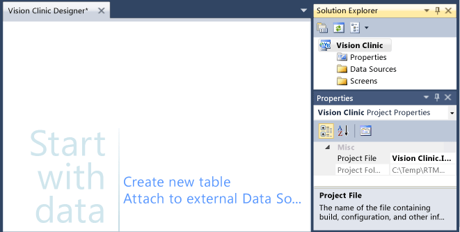  
  
##  <a name="Entities"></a> Define Tables  
 In LightSwitch, tables are referred to as entities; they model the object that the data represents (in this case, a collection of patients). LightSwitch applications use a "forms over data" model (that is, forms or screens that display data from one or more sources).  LightSwitch includes an intrinsic database in which you can store data for your application. In the next step, you’ll create a database table to store patient information.  
  
#### To create the Patient entity  
  
1.  In the **Vision Clinic Designer** window, choose the **Create New Table** link.  
  
     The Data Designer opens. In `Solution Explorer`, a **Table1Items** node appears under the **Data Sources** node in the **Vision Clinic.Server** project.  
  
2.  In the **Properties** window, name the table **Patient**, and then choose the Enter key.  
  
     The name in the **Data Designer** title bar changes to "Patient", and the name in **Solution Explorer** changes to "Patients.lsml".  
  
3.  In the **Name** column of the **Data Designer**, choose the **<Add property\>** link, enter **Name**, and then choose the Enter key.  
  
     Notice that the appropriate data type, `String`, appears in the **Type** column and the **Required** check box is selected. Users must specify a name for every patient.  
  
4.  In the **Name** column, choose the **<Add property\>** link, and then enter **Street**.  
  
5.  In the **Name** column, choose the **<Add property\>** link, and then enter **Street2**.  
  
6.  In the **Required** column, clear the check box.  
  
     The second line of a street address is optional.  
  
7.  In the **Name** column, choose the **<Add property\>** link, and then enter **City**.  
  
8.  In the **Name** column, choose the **<Add property\>** link, and then enter **State**.  
  
9. In the **Name** column, choose the **<Add property\>** link, and then enter **Zip**.  
  
10. In the **Name** column, choose the **<Add property\>** link, and then enter **PrimaryPhone**.  
  
11. In the **Type** column, open the list, and then choose **PhoneNumber**.  
  
     `PhoneNumber` is a custom business type that represents a common pattern for entering and formatting telephone numbers.  
  
12. In the **Required** column, clear the check box.  
  
13. In the **Name** column, choose the **<Add property\>** link, and then enter **SecondaryPhone**.  
  
14. In the **Type** column, open the list, and then choose **PhoneNumber**.  
  
15. In the **Required** column, clear the check box.  
  
16. In the **Name** column, choose the **<Add field\>** link, and then enter **Email**.  
  
17. In the **Type** column, open the list, and then choose **EmailAddress**.  
  
     `EmailAddress` is another custom business type that represents a correctly formatted email address.  
  
18. In the **Required** column, clear the check box.  
  
19. In the  **Name** column, choose the **<Add property\>** link, and then enter **PolicyNumber**.  
  
20. In the **Properties** window, set the **Maximum Length** property to `12`.  
  
     This value will prevent users from entering a policy number that contains more than 12 characters.  
  
     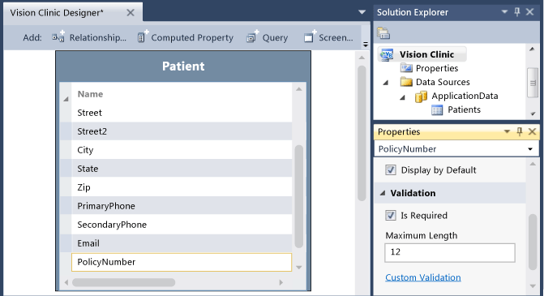  
  
21. In the **Properties** window, clear the **Enable Created/Modified** properties check box.  
  
     You can use created and modified properties to create an audit trail for the table, tracking who created a record or edited it most recently. But you don't need them for this entity.  
  
22. On the menu bar, choose **File**, **Save All** to save your work.  
  
 Next you’ll create two more entities to represent an invoice and invoice line items.  
  
#### To create the Invoice and InvoiceDetail entities  
  
1.  In **Solution Explorer**, choose the `Data Sources` node, and then, on the menu bar, choose **Project**, **Add Table**.  
  
     A new instance of the **Data Designer** opens.  
  
2.  In the **Properties** window, set the **Name** property to **Invoice**, and then choose the Enter key.  
  
3.  In the **Name** column, choose the **<Add property\>** link, enter **InvoiceDate**, and then choose the Tab key.  
  
4.  In the **Type** column, open the list, and then choose **DateTime**.  
  
5.  In the **Name** column, choose the **<Add property\>** link, enter **InvoiceDue**, and then choose the `Tab` key.  
  
6.  In the **Type** column, open the list, and then choose **DateTime**.  
  
7.  In the **Name** column, choose the **<Add property\>** link, enter **InvoiceStatus**, and then choose the `Tab` key.  
  
8.  In the **Type** column, open the list, and then choose **Integer**.  
  
9. In the **Name** column, choose the **<Add property\>** link, enter **ShipDate**, and then choose the `Tab` key.  
  
10. In the **Type** column, open the list, and then choose **DateTime**.  
  
     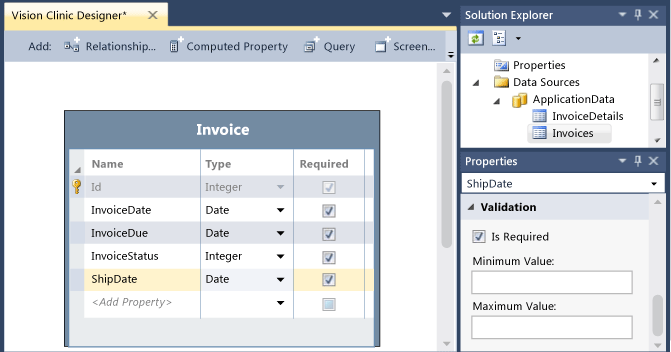  
  
11. In **Solution Explorer**, choose the `Data Sources` node, and then, on the menu bar, choose **Project**, **Add Table**.  
  
12. In the **Properties** window, set the **Name** property to **InvoiceDetail**, and then choose the Enter key.  
  
13. In the **Name** column, choose the **<Add property\>** link, enter **Quantity**, and then choose the `Tab` key.  
  
14. In the **Type** column, open the list, and then choose **Integer**.  
  
15. In the **Name** column, choose the **<Add property\>** link, and then enter **UnitPrice**.  
  
16. In the **Type** column, open the list, and then choose **Money**.  
  
     `Money` is another custom business type that represents and correctly formats currency.  
  
     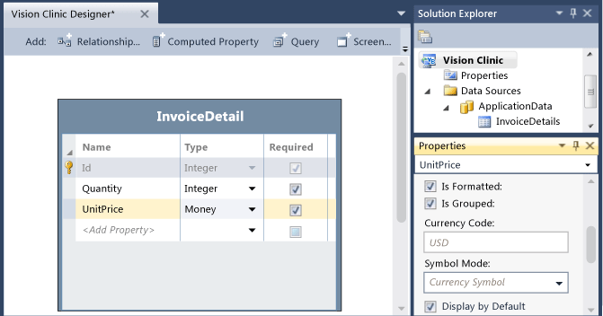  
  
17. In the **Properties** window, enter `$` in the **Currency Symbol** text box.  
  
18. On the menu bar, choose **File**, **Save All** to save your work.  
  
##  <a name="ChoiceList"></a> Create a Choice List  
 In the next step, you’ll create a choice list for the `Invoice` entity. By creating a choice list, you can present the user with a fixed set of values from which to choose.  
  
#### To create a choice list  
  
1.  In **Solution Explorer**, open the shortcut menu for the **Invoices.lsml** node, and then choose **Open**.  
  
2.  In the **Data Designer**, choose the **InvoiceStatus** field.  
  
3.  In the **Properties** window, choose the **Choice List** link.  
  
     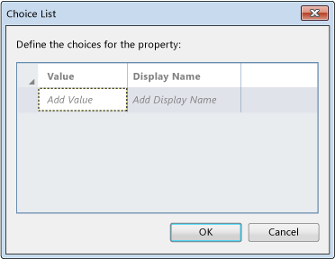  
  
4.  In the **Choice List** dialog box, enter the following values, and then choose the **OK** button.  
  
    |Value|Display Name|  
    |-----------|------------------|  
    |`0`|**Active**|  
    |`1`|**Paid**|  
    |`2`|**Overdue**|  
  
     When this field appears on a screen, the user can open a list and then choose any of the three **Display Name** values that you entered.  
  
5.  On the menu bar, choose **File**, **Save All** to save your work.  
  
##  <a name="Relationship"></a> Define a relationship  
 In the next step, you’ll define relationships between the **Patient**, **Invoice**, and **InvoiceDetail** entities.  
  
#### To define relationships  
  
1.  In **Solution Explorer**, open the shortcut menu for the **Invoices.lsml** node, and then choose **Open**.  
  
2.  On the **Data Designer** toolbar, choose the **Relationship** button.  
  
     The **Add New Relationship** dialog box appears.  
  
3.  In the **Name:** row, choose the **To** column, open the list, choose **Patient**, and then choose the **OK** button.  
  
     A one to many relationship is created between the `Patient` and `Invoice` entities. A patient can have multiple invoices.  
  
4.  On the **Data Designer** toolbar, choose the **Relationship** button.  
  
     The **Add New Relationship** dialog box opens.  
  
5.  In the **Name:** row, choose the **To** column, open the list, and then choose **InvoiceDetail**.  
  
6.  In the **Multiplicity:** row, choose the **From** column, open the list, and then choose **One**.  
  
7.  In the **Multiplicity:** row, choose the **To** column, open the list, choose **Many**, and then choose the **OK** button.  
  
     A one to many relationship is created between the `Invoice` and `InvoiceDetail` entities. An invoice can have multiple details.  
  
     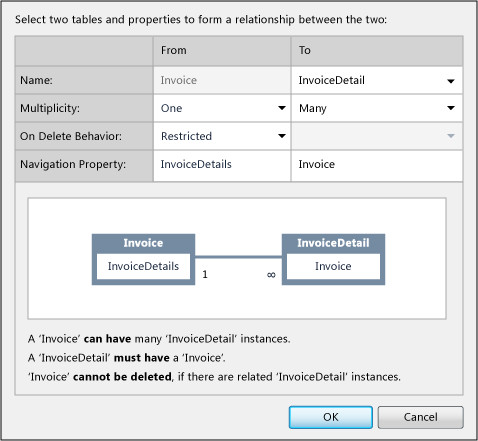  
  
8.  On the menu bar, choose **File**, **Save All** to save your work.  
  
##  <a name="appointment"></a> Create the Appointment Entity  
 In the next step, you’ll add one more entity to represent an appointment, and then you'll add a relationship and a choice list.  
  
#### To add the Appointment entity  
  
1.  In **Solution Explorer**, choose the `Data Sources` node, and then, on the menu bar, choose **Project**, **Add Table**.  
  
2.  In the **Properties** window, choose the **Name** text box, and then enter `Appointment`.  
  
3.  In the **Data Designer**, choose the **<Add property\>** placeholder text in the **Name** column, and then enter `AppointmentTime`.  
  
4.  In the **Type** column, open the list, and then choose **DateTime**.  
  
5.  In the **Data Designer**, choose the **<Add property\>** placeholder text in the **Name** column, and then enter `AppointmentDate`.  
  
6.  In the **Type** column, open the list, and then choose **Date**.  
  
7.  In the **Name** column, choose the **<Add property\>** placeholder text, and then enter `AppointmentType`.  
  
8.  In the **Type** column, open the list, and then choose **Short Integer**.  
  
9. In the  **Name** column, choose the **<Add property\>** placeholder text, and then enter `DoctorNotes`.  
  
10. Accept the default type, **String**, and clear the **Required** check box.  
  
11. On the **Data Designer** toolbar, choose the **Relationship** button.  
  
12. In the **Add New Relationship dialog box**, choose the **To** column in the **Name:** row.  
  
13. Open the list, choose **Patient**, and then choose the **OK** button.  
  
     A one-to-many relationship is created between the `Patient` and `Appointment` entities. Each patient can have multiple appointments.  
  
14. In the **Data Designer**, choose the `AppointmentType` field.  
  
15. In the **Properties** window, choose the **Choice List** link.  
  
16. In the **Choice List** dialog box, enter the following values, and then click the **OK** button.  
  
    |Value|Display Name|  
    |-----------|------------------|  
    |`0`|**Annual**|  
    |`1`|**Follow-up**|  
    |`2`|**Emergency**|  
  
     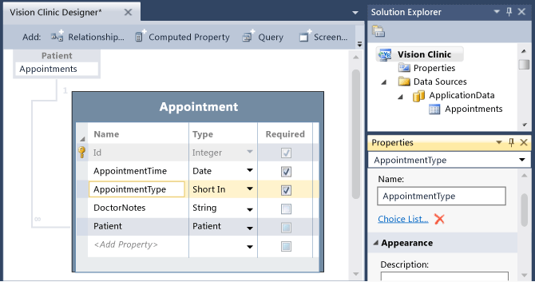  
  
17. On the **Perspective** bar, choose the **DesktopClient** tab.  
  
18. In the **Properties** window, open the list for the **Summary Property**, and then choose **AppointmentTime**.  
  
     This property defines the field that will appear when a list of appointments appears.  
  
19. On the menu bar, choose **File**, **Save All** to save your work.  
  
##  <a name="screen"></a> Create a Screen  
 In the next procedure, you’ll create a screen to display a list of patients.  
  
#### To create a screen  
  
1.  In **Solution Explorer**, choose the **Screens** node, and then, on the menu bar, choose **Project**, **Add Screen**.  
  
     The **Add New Screen** dialog box opens.  
  
2.  In the **Select a screen template** list, choose **Editable Grid Screen**.  
  
3.  In the **Screen Name** text box, enter `PatientList`.  
  
4.  In the **Screen Data** list, choose **Patients**, and then choose the **OK** button.  
  
     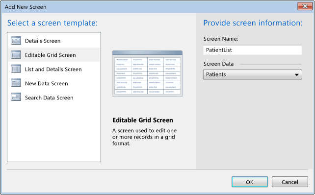  
  
     The **Screen Designer** opens, displaying a hierarchical representation of the screen layout.  
  
5.  On the menu bar, choose **File**, **Save All** to save your work.  
  
## Create an Appointment Screen  
 In the next procedure, you’ll create a screen to schedule appointments.  
  
#### To create the screen  
  
1.  In **Solution Explorer**, in the **Vision Clinic.Server** project, open the shortcut menu for the **Appointments.lsml** node, and then choose **Open**.  
  
2.  On the **Perspective** bar, choose the **DesktopClient** tab, and then, on the toolbar, choose the **Screen** button.  
  
3.  In the **Add New Screen** dialog box, in the **Select a screen template** list, choose **New Data Screen**.  
  
4.  In the **Screen Data** list, choose **Appointment**, and then choose the **OK** button.  
  
5.  In the **Screen Designer**, in the center pane, choose the **AppointmentTime** node.  
  
6.  In the **Properties** window, clear the **Show Date** check box.  
  
     This change will display just the time section of the **Date Time Picker** control.  
  
##  <a name="run"></a> Run the Application and Enter Data  
 You now have a working application. In the next step, you’ll run it and enter some data.  
  
#### To run the application  
  
1.  Choose the **F5** key to start the application.  
  
2.  In the running application, choose the **PatientList** screen, and then choose the add (**+**) button.  
  
     The **Add New Patient** dialog box appears.  
  
3.  Enter data for a new patient, and enter a value that's not valid in the **Email** field (for example, `john#example.com`).  
  
     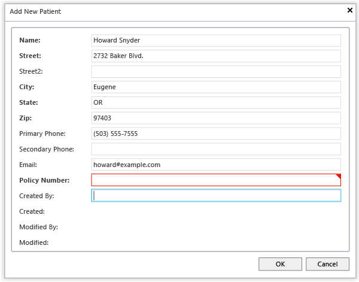  
  
     When you move away from the field, a red border appears. The `EmailAddress` business type has built-in validation rules that can detect an email address that's incorrectly formatted.  
  
4.  Correct the error, finish the data entry, and then choose the **OK** button.  
  
     On the application toolbar, the **Save** button is now enabled.  
  
5.  Add several more patients.  
  
6.  Choose the **Save** button to save your data.  
  
     You can now rearrange the columns in the **PatientList** grid, and you can sort on any column.  
  
7.  On the menu bar, choose **Tasks**, **Create New Appointment**.  
  
     The **Create New Appointment** screen opens.  
  
8.  Enter data for an appointment, choosing a patient from the **Patient** list and a time later today.  
  
9. Add several more appointments for later today, and then choose the **Save** button to save your data.  
  
10. In the upper-right corner of the running application, choose the **Close** button to return to design mode.  
  
##  <a name="data"></a> Connect to a Database  
 In the next step, you’ll connect to an external database that contains product information.  
  
> [!NOTE]
>  Before you perform this step, you must download the PrescriptionContoso database from [MSDN Code Gallery](http://code.msdn.microsoft.com/LightSwitch-in-Visual-bca65069) and then install the database by following the instructions in the Install.htm file.  
  
#### To attach to a data source  
  
1.  In **Solution Explorer**, choose the **Data Sources** node.  
  
2.  On the menu bar, choose **Project**, **Add Data Source**.  
  
3.  In the **Attach Data Source** wizard, choose the **Database** icon, and then choose the **Next** button.  
  
     The **Choose Data Source** dialog box opens.  
  
    > [!NOTE]
    >  If you've previously connected to a database in Visual Studio, this dialog box doesn’t appear, and you can skip the next step.  
  
4.  In the list, choose **Microsoft SQL Server**, and then choose the **Continue** button.  
  
5.  In the **Connection Properties** dialog box, enter the values in the following table, and then click the **OK** button.  
  
    |**Field**|`Value`|  
    |---------------|-------------|  
    |**Server Name**|`(localdb)\v11.0`|  
    |**Log on to the server**|`Use Windows Authentication`|  
    |**Select or enter a database name**|`C:\Temp\PrescriptionContoso.mdf`|  
  
     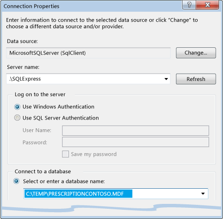  
  
     The **Choose your Database Objects** wizard page appears.  
  
6.  Expand the **Tables** node, choose the **Product** and **ProductRebate** tables, and then choose the **Finish** button.  
  
     The **C_TEMP_PRESCRIPTIONCONTOSO_MDFData** data source is added to the project, and entities are created for **Products** and **ProductRebates**.  
  
7.  In **Solution Explorer**, open the shortcut menu for the **C_TEMP_PRESCRIPTIONCONTOSO_MDFData** node, choose **Rename**, and then enter `PrescriptionContoso`.  
  
8.  On the menu bar, choose **File**, **Save All** to save your work.  
  
##  <a name="product"></a> Modify the Products and ProductRebate Entities  
 In the next step, you’ll change the ProductRebate and Products entities.  
  
#### To modify the ProductRebate and Products entities  
  
1.  In **Solution Explorer**, open the shortcut menu for the **ProductRebates.lsml** node, and then choose **Open**.  
  
2.  Choose the **Rebate** field, and then change the **Type** to **Money**.  
  
3.  In the **Properties** window, enter `$` in the **Currency Symbol** text box.  
  
4.  In **Solution Explorer**, open the shortcut menu for the **Products.lsml** node, and then choose **Open**.  
  
5.  In the **Data Designer**, choose the **MSRP** field, and then change the **Type** to **Money**.  
  
6.  In the **Properties** window, enter `$` in the **Currency Symbol** text box.  
  
7.  Choose the **ProductImage** field, and then change the **Type** to **Image**.  
  
8.  On the menu bar, choose **File**, **Save All** to save your work.  
  
##  <a name="productlist"></a> Create a List and Details Screen  
 In the next step, you’ll create a screen to display product information.  
  
#### To create a list and details screen  
  
1.  In the **Data Designer**, on the **Perspective** bar, choose the **DesktopClient** tab, and then, on the toolbar, choose the **Screen** button.  
  
     The **Add New Screen** dialog box opens.  
  
2.  In the **Select a screen template** list, choose **List and Details Screen**.  
  
3.  In the **Screen Name** text box, enter `ProductList`.  
  
4.  In the **Screen Data** list, choose **PrescriptionContoso.Products**.  
  
5.  In the **Additional Data to Include** list, select both the **Product Details** and **Product ProductRebates** check boxes, and then choose the **OK** button.  
  
##  <a name="layout"></a> Change the Screen Layout  
 In the next step, you’ll change the layout of the **ProductList** screen.  
  
#### To customize the layout  
  
1.  In the **Screen Designer**, in the **Screen Content Tree**, choose the **Rows Layout &#124;Product Details** node.  
  
2.  In the **Rows Layout** list, choose **Picture and Text**.  
  
3.  In the list for each field below the **Picture and Text** node, choose the following values:  
  
    |||  
    |-|-|  
    |Field|Value|  
    |**(PICTURE)**|**Product Image**|  
    |**(TITLE)**|**Product Name**|  
    |**(SUBTITLE)**|**MSRP**|  
    |**(DESCRIPTION)**|**Description**|  
  
     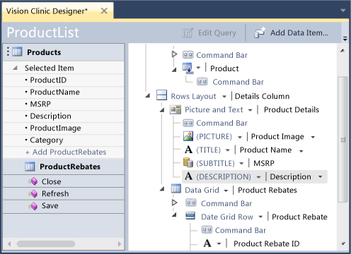  
  
4.  Choose the **F5** key to run the application and view the results.  
  
5.  In the running application, on the menu bar, choose **Tasks**, **Product List** to display the **ProductList** screen.  
  
     Keep the application open. In the next step, you’ll make changes in the running application.  
  
##  <a name="running"></a> Making Changes in the Running Application  
 In the next step, you’ll modify the **Product List** screen while the application is running.  
  
#### To customize a screen at run time  
  
1.  In the lower-right corner of the **Product List** screen, choose the **Design Screen** link.  
  
2.  In the left pane, choose the **Data Grid &#124; Product Rebates** node.  
  
3.  In the **Properties** window, set the **Display Name** property to `Contoso Rebates`.  
  
     The name also changes in the application window.  
  
4.  Choose the **MSRP** field, and then set the **Description** property to `Suggested price before any rebates.`.  
  
     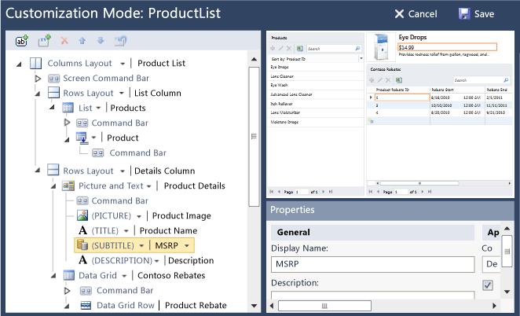  
  
5.  Choose the **Save** button to return to the running application and view the changes.  
  
     For example, you can point to the MSRP field to show the description.  
  
6.  In the upper-right corner of the running application, choose the **Close** button to return to design mode.  
  
7.  On the menu bar, choose **File**, **Save All** to save your work.  
  
##  <a name="query"></a> Creating a Query  
 In the next step, you’ll create a parameterized query and bind it to a screen.  
  
#### To create a parameterized query  
  
1.  In **Solution Explorer**, open the shortcut menu for the **Products** node, and then choose **Add Query**.  
  
     The **Query Designer** opens.  
  
2.  In the **Properties** window, choose the **Name** text box, and then enter `RelatedProducts`.  
  
3.  In the **Query Designer**, choose the **Add Filter** link.  
  
     A filter condition is added to the **Filter** section.  
  
4.  In the second list, choose **Category**.  
  
5.  In the fourth list, choose **Parameter**.  
  
6.  In the fifth list, choose **Add New**.  
  
     A new `Parameter` that's named `Category` of type `String` is added to the **Parameters** section.  
  
     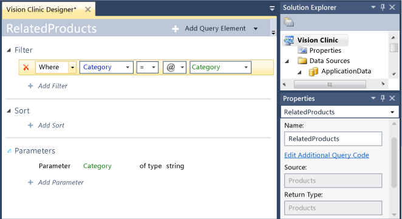  
  
7.  In **Solution Explorer**, open the shortcut menu for the **ProductList.lsml** node, and then choose **Open**.  
  
8.  On the **Screen Designer** toolbar, choose the **Add Data Item** button.  
  
9. In the **Add Data Item** dialog box, choose the **Query** option button.  
  
10. In the **Name** column, choose **PrescriptionContoso.RelatedProducts**, and then choose the **OK** button.  
  
     A **RelatedProducts** node appears in the left pane.  
  
11. Under **Query Parameters**, choose the **Category** node.  
  
12. In the **Properties** window, set the **Parameter Binding** property to `Products.SelectedItem.Category`.  
  
13. In the center pane, expand the **Add** node below the **DataGrid &#124;Contoso Rebates** node, and then choose **Related Products**.  
  
     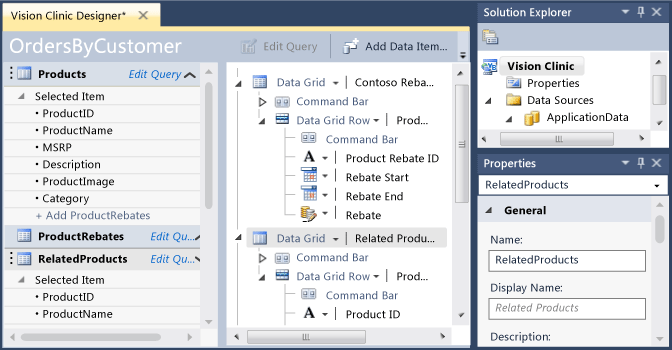  
  
14. Choose the **F5** key to run the application and view the results.  
  
     If you open the **Products List** screen, a list of related products appears for each selected product.  
  
15. In the upper-right corner of the running application, choose the **Close** button to return to design mode.  
  
16. On the menu bar, choose **File**, **Save All** to save your work.  
  
##  <a name="computed"></a> Add a Computed Field  
 In the next step, you’ll add a field that uses a computed value. The computed value will be the price of a product after a rebate amount is applied.  
  
#### To add a computed field  
  
1.  In **Solution Explorer**, open the shortcut menu for the **Products.lsml** entity node, and then choose **Open**.  
  
2.  In the **Data Designer**, on the **Perspective** bar, choose the **Server** tab.  
  
3.  Choose the **<Add Property\>** link, enter `CurrentPrice`, and then choose the Tab key.  
  
4.  In the **Type** column, open the list, and then choose **Money**.  
  
     In the **Properties** window, in the **General** section, the **Is Computed** check box is selected by default.  
  
5.  In the **Properties** window, enter `$` in the **Currency Symbol** text box.  
  
6.  In the **Properties** window, choose the **Edit Method** link.  
  
     The **Code Editor** opens, and the `CurrentPrice_Compute` method appears.  
  
7.  Add the following code to the event handler:  
  
    ```vb  
    Dim rebates As Decimal  
        For Each item In ProductRebates  
            If item.RebateStart <= Date.Today And item.RebateEnd >= Date.Today Then  
                rebates = rebates + item.Rebate  
            End If  
        Next  
  
        result = Me.MSRP - rebates  
  
    ```  
  
    ```c#  
    decimal rebates = default(decimal);  
  
                foreach (var item in ProductRebates)  
                {  
                    if (item.RebateStart <= System.DateTime.Today && item.RebateEnd >= System.DateTime.Today)  
                    {  
                        rebates += item.Rebate.Value;  
                    }  
                }  
  
                result = this.MSRP - rebates;  
    ```  
  
     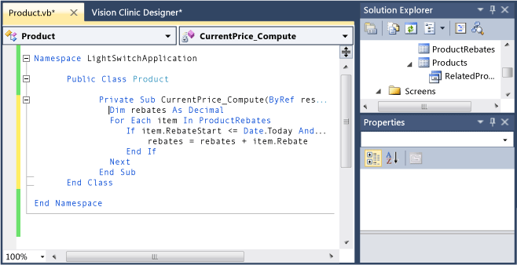  
  
8.  On the menu bar, choose **File**, **Save All** to save your work.  
  
 In the next procedure, you’ll add the computed field to the **ProductList** screen.  
  
#### To add a computed field to a screen  
  
1.  In **Solution Explorer**, open the shortcut menu for the **ProductList.lsml** screen node, and then choose **Open**.  
  
2.  In the left pane of the **Screen Designer**, move the **CurrentPrice** node below the **(Description) &#124; Description** node in the center pane.  
  
     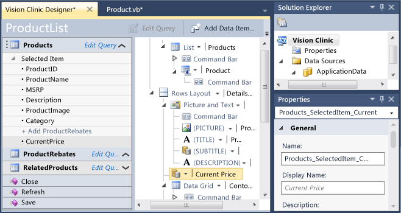  
  
3.  Choose the **F5** key to run the application and view the results.  
  
4.  In the **ProductList** screen, edit the **Rebate** or **MSRP** field.  
  
     The **CurrentPrice** is recomputed.  
  
5.  In the upper-right corner of the running application, choose the **Close** button to return to design mode.  
  
6.  On the menu bar, choose **File**, **Save All** to save your work.  
  
##  <a name="cross"></a> Create a Cross-database Relationship  
 In the next step, you’ll create a virtual relationship between entities in two databases, and you'll display data from two sources on a single List and Details screen.  
  
#### To create a cross-database relationship  
  
1.  In **Solution Explorer**, open the shortcut menu for the **InvoiceDetails.lsml** node, and then choose **Open**.  
  
2.  In the **Data Designer**, on the toolbar, choose the **Relationship** button.  
  
     The **Add New Relationship** dialog box opens.  
  
3.  In the **To** column, choose the **Name** field, open the list, and then choose **Product**.  
  
     A new section appears at the bottom of the dialog box. The section shows the related fields in the two entities. If necessary, you could change the related fields to another field of the same data type or define multiple related fields as keys.  
  
     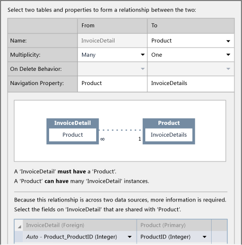  
  
4.  Choose the **OK** button to save the relationship.  
  
     The designer shows the new relationship as a dotted line. This line indicates that the entities are in different data sources In this case, `InvoiceDetails` is from the intrinsic database, and `Products` is from the PrescriptionContoso database.  
  
5.  On the menu bar, choose **File**, **Save All** to save your work.  
  
##  <a name="invoices"></a> Create a Screen to Display Invoices  
 In the next step, you’ll create a screen to display invoices.  
  
#### To create a screen  
  
1.  In **Solution Explorer**, choose the **Screens** node, and then, on the menu bar, choose **Project**, **Add Screen**.  
  
     The **Add New Screen** dialog box opens.  
  
2.  In the **Select a screen template** list, choose **List and Details Screen**.  
  
3.  In the **Screen Name** text box, enter `InvoiceScreen`.  
  
4.  In the **Screen Data** list, choose **Invoices**.  
  
5.  In the **Additional Data to Include** list, choose **Invoice Details** and **Invoice InvoiceDetails**, and then choose the **OK** button.  
  
     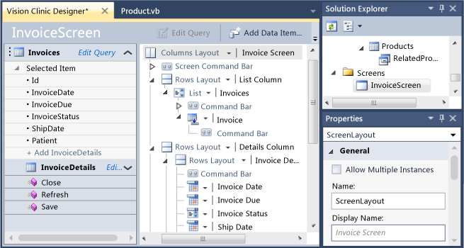  
  
6.  Expand the **Data Grid Row &#124; Invoice Detail** node, and then delete the **Product Product ID** node.  
  
7.  To reorder the fields, move the **Quantity** and **UnitPrice** nodes under the **Product** node.  
  
8.  Choose the **F5** key to run the application.  
  
9. On the menu bar, choose **Tasks**, **Invoice Screen** to display the screen.  
  
10. In the **Invoices** pane, choose the add (**+**) button, and then enter some invoice data.  
  
     The **InvoiceStatus** field provides a list of values, and the **Patient** field contains a button that opens a dialog box that lists patients.  
  
11. In the **Invoice Details** pane, choose the add **+…** button, and then enter some invoice-detail data.  
  
     The **Product** field provides a list of products from the PrescriptionContoso database.  
  
12. Choose the **Save** button to save your invoice data, and keep the application open.  
  
     In the next procedure, you’ll make changes in the running application.  
  
##  <a name="running2"></a> Modify the Invoices Screen  
 In the next step, you’ll change the Invoices screen in the running application.  
  
#### To modify a screen in the running application  
  
1.  In the lower-right corner of the **Invoice Screen** screen, choose the **Design Screen** link.  
  
2.  In the left pane, choose the **List &#124; Invoices** node, open the **List** list, and then choose **DataGrid**.  
  
3.  Choose the **Patient** node, and then choose the **MoveUp** arrow in the left margin to move the node above the  **Invoice Date** node.  
  
     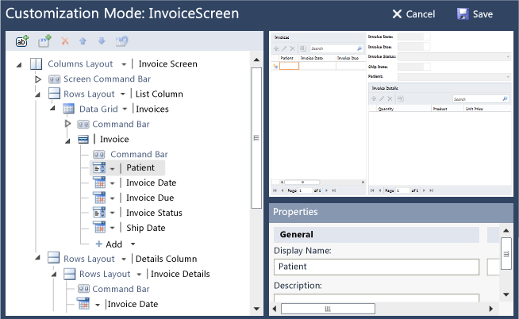  
  
4.  Choose the **Save** button to return to the running application and view the changes.  
  
5.  In the upper-right corner of the running application, choose the **Close** button to return to design mode.  
  
6.  On the menu bar, choose **File**, **Save All** to save your work.  
  
##  <a name="logic"></a> Define Screen Logic  
 In the next step, you’ll add code to define the default logic for invoice dates.  
  
#### To define screen logic  
  
1.  In **Solution Explorer**, open the shortcut menu for the **Invoices.lsml** node, and then choose **Open**.  
  
2.  In the **Data Designer**, on the toolbar, open the **Write Code** list, and then choose **Invoice_Created**.  
  
     The **Code Editor** opens and displays the `Invoice_Created` method.  
  
3.  In the `Invoice_Created` method, add the following code to set default behavior for dates:  
  
    ```vb  
    InvoiceDate = Date.Today  
    InvoiceDue = Date.Today.AddDays(30)  
    ShipDate = Date.Today.AddDays(3)  
    ```  
  
    ```c#  
    InvoiceDate = System.DateTime.Today;  
    InvoiceDue = System.DateTime.Today.AddDays(30);  
    ShipDate = System.DateTime.Today.AddDays(3);  
    ```  
  
4.  In **Solution Explorer**, open the shortcut menu for the **Invoices.lsml** node, and then choose **Open**.  
  
5.  In the **Data Designer**, choose the `InvoiceDate` field.  
  
6.  On the toolbar, open the **Write Code** list, and then choose **InvoiceDate_Changed**.  
  
7.  In the `InvoiceDate_Changed` method, add the following code to update dates when the InvoiceDate is changed:  
  
    ```vb  
    InvoiceDue = InvoiceDate.AddDays(30)  
    ‘ If the ShipDate is earlier than the new InvoiceDate, update it.  
    If ShipDate < InvoiceDate Then  
        ShipDate = InvoiceDate.AddDays(2)  
    End If  
    ```  
  
    ```c#  
    InvoiceDue = InvoiceDate.AddDays(30);   
        // If the ShipDate is earlier than the new InvoiceDate, update it  
    if (ShipDate < InvoiceDate)  
        {  
            ShipDate = InvoiceDate.AddDays(2);  
        }  
    ```  
  
8.  In **Solution Explorer**, open the shortcut menu for the **InvoiceDetails.lsml** node and choose **Open**.  
  
9. In the **Data Designer**, choose the **Product** field.  
  
10. On the toolbar, open the **Write Code** list, and then choose **Product_Changed**.  
  
11. In the **Code Editor**, add the following code to set the unit price and default quantity:  
  
    ```vb  
    UnitPrice = Product.CurrentPrice  
    Quantity = 1  
    ```  
  
    ```c#  
    UnitPrice = Product.CurrentPrice;  
  
    Quantity = 1;  
    ```  
  
12. Choose the **F5** key to run the application, open the **Invoice** screen, and add an invoice.  
  
     The date fields, price, and quantity are now automatically updated.  
  
13. Choose the **Save** button to save your changes.  
  
14. In the upper-right corner of the running application, choose the **Close** button to return to design mode.  
  
15. On the menu bar, choose **File**, **Save All** to save your work.  
  
##  <a name="computed2"></a> Add More Computed Fields  
 In the next step, you’ll add computed fields for SubTotal, Tax, and Totals to the **InvoiceDetails** and **Invoices** entities.  
  
#### To add computed fields  
  
1.  In **Solution Explorer**, open the shortcut menu for the **InvoiceDetails.lsml** node, and then choose **Open**.  
  
2.  In the **Data Designer**, choose the **<Add Property\>** link, enter `SubTotal`, and then choose the `Tab` key.  
  
3.  In the **Type** column, open the list, and then choose **Money**.  
  
4.  In the **Properties** window, enter `$` in the **Currency Symbol** text box  
  
5.  In the **Properties** window, in the **General Properties** section, select the **IsComputed** check box, and then choose the **Edit Method** link.  
  
     The **Code Editor** opens and displays the `SubTotal_Compute` method.  
  
6.  Add the following code to compute the `SubTotal`:  
  
    ```vb  
    result = Quantity * UnitPrice  
    ```  
  
    ```c#  
    result = Quantity * UnitPrice;  
    ```  
  
7.  In **Solution Explorer**, open the shortcut menu for the **Invoices.lsml** node, and then choose **Open**.  
  
8.  In the **Data Designer**, choose the **<Add Property\>** link, and enter `Tax`, and then choose the `Tab` key.  
  
9. In the **Type** column, open the list, and then choose **Money**.  
  
10. In the **Properties** window, enter `$` in the **Currency Symbol** text box.  
  
11. In the **Properties** window, select the **IsComputed** check box, and then choose the **Edit Method** link.  
  
     The **Code Editor** opens and displays the `Tax_Compute` method.  
  
12. Replace the `Tax_Compute` method with the following code to compute the `Tax`:  
  
    ```vb  
    Private Sub Tax_Compute(ByRef result As Decimal)  
        result =  GetSubTotal() * 0.095  
    End Sub  
    Protected Function GetSubTotal() As Decimal  
        GetSubtotal = 0  
        For Each item In InvoiceDetails  
            GetSubTotal = GetSubTotal + item.SubTotal  
        Next  
    End Function  
    ```  
  
    ```c#  
    partial void Tax_Compute(ref decimal result)  
        {  
            result = GetSubTotal() * (decimal)0.095;  
        }  
    protected decimal GetSubTotal()  
        {  
            return this.InvoiceDetails.Sum(i => i.SubTotal);  
        }  
    ```  
  
13. In **Solution Explorer**, open the shortcut menu for the **Invoices.lsml** node, and then choose **Open**.  
  
14. In the **Data Designer**, choose the **<Add Property\>** link, enter `Total`, and then choose the `Tab` key.  
  
15. In the **Type** column, open the list, and then choose **Money**.  
  
16. In the **Properties** window, enter `$` in the **Currency Symbol** text box.  
  
17. In the **Properties** window, select the **IsComputed** check box, and then choose the **Edit Method** link.  
  
     The **Code Editor** opens and displays the `Total_Compute` method.  
  
18. Add the following code to compute the `Total`:  
  
    ```vb  
    result = GetSubTotal() + Tax  
    ```  
  
    ```c#  
    result = GetSubTotal() + Tax;  
    ```  
  
19. On the menu bar, choose **File**, **Save All** to save your work.  
  
 In the next step, you’ll add the new fields to the **Invoices** screen.  
  
#### To add fields to a screen  
  
1.  In **Solution Explorer**, open the shortcut menu for the **InvoiceScreen.lsml** node, and then choose **Open**.  
  
2.  In the center pane, expand the **Rows Layout &#124; Invoice Details** node, expand the **Add**  list, and then choose **Tax**.  
  
     The **Tax** field appears in the **Vertical Stack &#124; InvoiceDetails** section.  
  
3.  Open the **Add**  list again, and then choose the **Total** field.  
  
4.  Choose the **F5** key to run the application, and then open the **Invoice Screen** screen.  
  
     The **Tax** and **Total** fields now appear for each invoice row.  
  
5.  Choose the **Design Screen** link to change to the customization mode.  
  
6.  In the left pane, expand the **Data Grid Row &#124;Invoice Detail** node, expand the **Add**  list, and then choose **SubTotal**.  
  
7.  Choose the **Save** button to save the change.  
  
     A **SubTotal** field now appears in the **Invoice Details** grid.  
  
       
  
8.  In the upper-right corner of the running application, choose the **Close** button to return to design mode.  
  
9. On the menu bar, choose **File**, **Save All** to save your work.  
  
##  <a name="html"></a> Add a Mobile Client  
 So far, the screens that you’ve created are optimized for data entry on a desktop computer. Some tasks in the clinic, such as viewing patient information and upcoming appointments, are better suited for mobile devices. You can use LightSwitch to create screens that users can view in a browser on most tablets and phones. In the next step, you’ll create HTML client screens to browse patients and appointments.  
  
#### To add an HTML client project  
  
1.  In **Solution Explorer**, open the shortcut menu for the **Vision Clinic** node, and then choose **Add Client**.  
  
2.  In the **Add Client** dialog box, choose the **HTML Client** item, and then choose the **OK** button.  
  
     A **VisionClinic.HTMLClient** project is added to the solution.  
  
#### To add a screen to browse patients  
  
1.  In **Solution Explorer**, in the **Vision Clinic.Server** project, open the shortcut menu for the **Patients.lsml** node, and then choose **Open**.  
  
2.  On the **Perspective** bar, choose the **HTMLClient** tab, and then, on the toolbar, choose the **Screen** button.  
  
     The **Add New Screen** dialog box opens.  
  
3.  In the **Select a screen template** list, choose **Browse Data Screen**.  
  
4.  In the **Screen Data** list, choose **Patients**, and then choose the **OK** button.  
  
#### To customize the browse screen  
  
1.  In the **Screen Designer**, in the **Screen Content Tree**, choose the **List &#124;Patients** node.  
  
2.  In the **List** list, choose **Tile List**.  
  
     This option will display a tile for each patient. By default, the tile shows all fields for the patient.  
  
3.  Under the **Rows Layout &#124; Patient** node, delete all fields except **First Name**, **Last Name**, and **Policy Number**.  
  
4.  In **Solution Explorer**, in the **Vision Clinic.HTMLClient** project, open the shortcut menu for the **BrowsePatients.lsml** node, and then choose **Set as Home Screen**.  
  
5.  Choose the **F5** key to run the application.  
  
     If you resize the browser window, the tile arrangement changes as the window gets narrower, optimizing the view for screens on smaller devices, such as phones.  
  
6.  In the upper-right corner of the running application, choose the **Close** button to return to design mode.  
  
7.  On the menu bar, choose **File**, **Save All** to save your work.  
  
     Next, you’ll add a screen to view patient details.  
  
#### To add a details screen  
  
1.  In the **Screen Designer**, in the **Screen Content Tree**, choose the **Tile List &#124;Patients** node.  
  
2.  In the **Properties** window, in the **Actions** section, choose the **Item Tap: None** link.  
  
3.  In the **Edit ItemTap Action** dialog box, expand the **ShowTab** list, choose **viewSelected**, and then choose the **OK** button.  
  
4.  In the **Add New Screen** dialog box, accept the default values, and then choose the **OK** button.  
  
5.  Choose the **F5** key to run the application.  
  
6.  On the **Browse Patients** screen, choose a patient to open the **View Patient** screen.  
  
     Notice that the **Primary Phone**, **Secondary Phone**, and **Email** fields are hyperlinks. These fields are based on custom business types, and the ability to initiate a phone call or send an email is built into the custom controls for these types.  
  
7.  In the upper-right corner of the running application, choose the **Close** button to return to design mode.  
  
8.  On the menu bar, choose **File**, **Save All** to save your work.  
  
     Next, you’ll add a query-based screen to view upcoming appointments.  
  
#### To create a query  
  
1.  In **Solution Explorer**, open the shortcut menu for the **Appointments.lsml** node, and then choose **Add Query**.  
  
2.  In the **Properties** window, enter `UpcomingAppointments` in the **Name** text box.  
  
3.  In the **Query Designer**, choose the **Add Filter** link.  
  
4.  In the third list, choose **>= (is greater than or equal to)**.  
  
5.  In the fourth list, choose **Global**.  
  
6.  In the fifth list, choose **Today**.  
  
7.  Choose the **Add Filter** link again.  
  
8.  In the second list, choose **AppointmentTime**.  
  
9. In the third list, choose **>= (is greater than or equal to)**.  
  
10. In the fourth list, choose **Global**.  
  
11. In the fifth list, choose **Now**.  
  
12. Choose the **Add Sort** link, and then accept the default values of **AppointmentDate** and **Ascending**.  
  
13. Choose the **Add Sort** link again, and then accept the default values of **AppointmentTime** and **Ascending**.  
  
     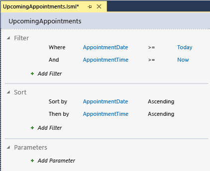  
  
14. On the menu bar, choose **File**, **Save All** to save your work.  
  
#### To create an appointment screen  
  
1.  In **Solution Explorer**, open the shortcut menu for the **Appointments.lsml** node, and then choose **Open**.  
  
2.  In the **Data Designer**, on the **Perspective** bar, choose the **HTMLClient** tab.  
  
3.  In the **Properties** window, open the **Summary Property** list, and then choose **AppointmentTime**.  
  
4.  In the **Data Designer**, on the toolbar, choose the **Screen** button.  
  
5.  In the **Add New Screen** dialog box, in the **Select a screen template** list, choose **Browse Data Screen**.  
  
6.  In the **Screen Data** list, choose **UpcomingAppointments**, and then choose the **OK** button.  
  
#### To create an appointment detail screen  
  
1.  In the **Screen Designer**, in the **Screen Content Tree**, choose the **List &#124; Upcoming Appointments** node.  
  
2.  In the **Properties** window, in the **Actions** section, choose the **Item Tap: None** link.  
  
3.  In the **Edit ItemTap Action** dialog box, expand the **ShowTab** list, choose **viewSelected**, and then choose the **OK** button.  
  
4.  In the **Add New Screen** dialog box, accept the default values, and choose the **OK** button.  
  
#### To add screen navigation  
  
1.  In **Solution Explorer**, open the shortcut menu for the **Vision Clinic.HTMLClient** node, and then choose **Edit Screen Navigation**.  
  
2.  In the **Application Designer**, choose the **Include Screen** link, and then choose **Browse Patients**.  
  
3.  Choose the **Include Screen** link again, and then choose **Browse Upcoming Appointments**.  
  
4.  Choose the **F5** key to run the application.  
  
5.  On the **Browse Patients** screen, choose the down arrow next to the title bar, and then choose **Browse Upcoming Appointments** to open the **Appointments** screen.  
  
       
  
     Notice that the **Appointments** screen now has a back button, which you can choose to return to the **Patients** screen. Also notice that, when you resize the browser window, the navigation menu is still available, but the title is truncated. You’ll fix that problem by adding some JavaScript code in the final procedure.  
  
6.  In the upper-right corner of the running application, choose the **Close** button to return to design mode.  
  
7.  On the menu bar, choose **File**, **Save All** to save your work.  
  
#### To modify the screen title  
  
1.  In **Solution Explorer**, open the shortcut menu for the **BrowseUpcomingAppointments.lsml** node, and then choose **Open**.  
  
2.  In the **Screen Designer**, on the toolbar, open the **Write Code** list, and then choose **created**.  
  
3.  In the **Code Editor**, add the following code to the **created** method:  
  
    ```javascript  
    screen.details.displayName = "Appointments";  
    ```  
  
4.  Choose the **F5** key to run the application.  
  
5.  On the **Browse Patients** screen, choose the down arrow next to the title bar, and then choose **Browse Upcoming Appointments** to open the **Appointments** screen.  
  
     Notice that the title is now **Appointments**.  
  
6.  In the upper-right corner of the running application, choose the **Close** button to return to design mode.  
  
7.  On the menu bar, choose **File**, **Save All** to save your work.  
  
 This procedure completes the Vision Clinic Application walkthrough. You should now have a basic understanding of the end-to-end process of creating a LightSwitch application.  
  
 At this point you could publish your application to either Internet Information Services (IIS) or to Microsoft Azure, making the application available to other users.  
  
 This walkthrough demonstrated the basic capabilities of LightSwitch, but you can use it to do much more. As you start to build your own applications, you can learn about more capabilities in the product documentation.  
  
## See Also  
 [Getting Started with LightSwitch](../vs140/Getting-Started-with-LightSwitch.md)   
 [LightSwitch Guided Tour](../vs140/LightSwitch-Guided-Tour.md)   
 [Visual Studio LightSwitch](../vs140/Visual-Studio-LightSwitch.md)