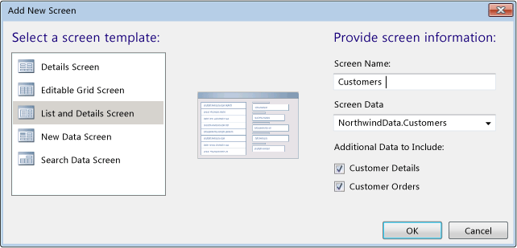

# Walkthrough: Designing a Silverlight Screen in LightSwitch
This walkthrough shows you how to use the LightSwitch screen designer to create a screen that displays customer data from the Northwind sample database. The screen designer is a visual design canvas that you can use to modify the appearance of a screen.  
  
 This walkthrough shows you how to perform the following tasks:  
  
-   Create a screen  
  
-   Change the layout of a screen  
  
-   Remove fields from a screen  
  
-   Change the order of items  
  
-   Change the display name of an item  
  
-   Change the control type of an item  
  
-   Customize a screen in a running application  
  
## Prerequisites  
 This walkthrough assumes that you have added the Northwind OData service as a data source in your project.  
  
 For information about how to add the Northwind OData service as a data source in your project, see [Connecting to Data](../vs140/Connecting-to-Data-in-a-LightSwitch-Application.md).  
  
## Creating a Screen  
 This section shows you how to create a screen to display the customer data from the Northwind sample database. This screen is divided into two parts. The first part displays a summary list of all the customers; the other part displays details about the customer that is selected.  
  
#### To create a screen  
  
1.  In **Solution Explorer**, open the shortcut menu for the **Screens** node, and then choose **Open**.  
  
2.  On the menu bar, choose **Project**, **Add Screen**.  
  
     The **Add New Screen** dialog box opens.  
  
3.  In the the **Select a screen template** list, choose **List and Details Screen**.  
  
4.  In the **Screen Name** text box, enter `Customers`.  
  
5.  In the **Screen Data** list, choose *DataSourceName*.**Customers**.  
  
6.  In the **Additional Data to Include** section, select the **Customer Details** and **Customer Orders** check boxes.  
  
     This adds the fields of the **Customer** entity to the details part of the screen, together with a list of the orders that were placed by that customer.  
  
     The following illustration shows how the dialog box appears after you have performed the steps in this section.  
  
       
  
7.  Choose the **OK** button to create the screen.  
  
     The **Screen Designer** appears.  
  
## Changing the Layout of the Screen  
 The **List and Details** screen has two columns. The left column is a list of the customers. The right column contains two rows. The top row contains the details of the selected customer and the bottom row contains orders that are related to the selected customer. The screen content tree of the screen designer shows how this list is composed.  
  
 This section shows how to modify the layout of the screen so that the screen contains two rows instead of two columns. The top row will contain the list of customers. The bottom row will contain two columns. The left column will contain the details of the selected customer and the right column will contain the orders that are related to the selected customer.  
  
#### To change the layout of the list  
  
1.  In the **Screen Content Tree** of the **Screen Designer**, choose the down arrow that appears next to the **Customers** node, and then choose **Rows Layout**.  
  
     The layout of the **Customers** node changes from **Columns Layout** to **Rows Layout**.  
  
2.  Choose the down arrow that appears next to the **Details Column** node, and then choose **Columns Layout**.  
  
     The layout of the **Details Column** changes from **Rows Layout** to **Columns Layout**.  
  
## Removing Fields from a Screen  
 By default, the area of the screen that displays the details of a customer named **Details Column** displays all of the fields from the data source. If you do not want all of the fields to appear, you can remove the ones you do not want. For example, the following steps show how to remove the **Country** field.  
  
#### To remove fields from a screen  
  
1.  In the **Screen Content Tree**, expand the **Customer Details** node if it is not already expanded.  
  
2.  Choose the **Country** field, and then, on the command bar of the **Screen Designer**, choose the **Delete** command.  
  
## Changing the Order of Fields  
 The following steps show how to change the display order of fields, for example, the `CustomerID` field and the `Postal Code` field.  
  
#### To change the order of fields  
  
1.  In the **Screen Content Tree**, expand the **Customer Details** node if it is not already expanded.  
  
2.  To move the **CustomerID** field to the bottom of the details column, drag the field under the **Fax** field.  
  
    > [!NOTE]
    >  You can also open the shortcut menu for the **CustomerID** field, choose **Cut**, open the shortcut menu for the **Fax** field, and then choose **Paste**.  
  
3.  To move the **Postal Code** field so that it appears just above the **Customer ID** field, drag it between the **Fax** field and the **CustomerID** field.  
  
## Changing the Control Type of a Field  
 You can customize how a field is displayed to the user. For example, you can set a text field to appear as either a `TextBox` or as a `Label`. The following steps show how to change a display field to a `Label` field so that the user cannot modify its value.  
  
#### To change the control type of a field  
  
1.  In the **Screen Content Tree**, expand the **Customer Details** node if it is not already expanded.  
  
2.  Open the list for the **Customer ID** field, and then choose **Label**.  
  
     You can repeat this step to change other fields.  
  
3.  To test the changes, choose the F5 key to run the application.  
  
## Customizing a Screen in a Running Application  
 You can also customize a screen while the application is running. For example, you can remove fields, change the order of fields, and change properties such as control type or label alignment.  
  
#### To customize a screen in a running application  
  
1.  If your application is not already running, choose the F5 key to start it.  
  
2.  On the screen command bar, choose the **Design Screen** link.  
  
3.  In the **Customization Mode** screen, remove the **Customer ID** field from the details column by choosing it in the **Customer Details** node, and then, on the toolbar, choosing the **Delete** () button.  
  
4.  In the **Customer Details** node, choose the **Fax** field, and then, on the toolbar, choose the **Move Down** () button.  
  
     The **Fax** field appears under the **Postal Code** field.  
  
5.  In the **Customer Details** node, choose the **Phone** field, and then, in the **Properties** window, set the **Display Name** property to `Phone Number`.  
  
6.  In the **Customer Details** node, choose the **Phone Number** field, and then, in the **Properties** window, set the **Control Type** property to **Label**.  
  
7.  In the **Customer Details** node, choose the **Company Name** field, and then, in the **Properties** windows, set the **Label Position** property to **Right-aligned**.  
  
8.  Repeat this step for all of the fields in the **Customer Details** node, and then choose the **Save** button.  
  
     Your application now displays the changes that you just made.  
  
## Next Steps  
 By default, when you choose a data source for a screen, all the data in the source appears. If you only want to display a subset of the data, you can create a query to define the data to display. See [How to: Target Specific Data by Designing a Query](../Topic/How%20to:%20Design%20a%20Query%20by%20Using%20the%20Query%20Designer.md).  
  
## See Also  
 [Screens: What the User Sees](../vs140/Screens--The-User-Interface-of-Your-LightSwitch-Application.md)