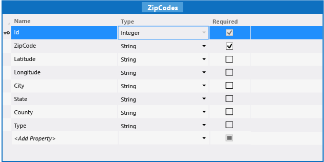

# Walkthrough: Managing Data in a  LightSwitch Application
By creating a database project, you can help your users view, enter, and update data as they use your LightSwitch application. For example, this walkthrough demonstrates how to create an application in which users can store customer information such as addresses. If a user provides a ZIP Code for a customer, the application automatically fills in the name of the city and the state where that customer is located. You can use the same techniques to provide data that's specific to your application.  
  
 As you follow this walkthrough, you’ll create a database project and add it to the solution for your LightSwitch application. You'll also create a post-deployment script that populates a table of ZIP Codes, and you'll add code that looks up the city and state when the user enters a ZIP Code.  
  
## Prerequisites  
 This walkthrough requires the sample files in the download [Managing Data in a LightSwitch Application](http://code.msdn.com/Managing-Data-in-a-39a67bc6).  
  
### To create the LightSwitch solution  
  
1.  On the menu bar, choose **File**, **New**, **Project**.  
  
2.  In the **New Project** dialog box, expand the **Visual Basic** or **Visual C#** node, and then choose the **LightSwitch** node.  
  
3.  In the template list, choose either **LightSwitch HTML Application (Visual Basic)** or **LightSwitch HTML Application (Visual C#)**.  
  
    > [!NOTE]
    >  HTML applications are optimized for mobile devices, but you can use the same techniques for a desktop application.  
  
4.  In the **Name** text box, enter `LightSwitchData`, and then choose the **OK** button.  
  
### To create the customer table and screens  
  
1.  In **Solution Explorer**, open the shortcut menu for the **Data Sources** node, and then choose **Add Table**.  
  
2.  In the **Properties** window, set the **Name** property to `Customer`.  
  
3.  In the data designer, add the following values:  
  
       
  
4.  On the **Perspective** bar, choose the **HTML Client** tab.  
  
5.  On the toolbar, choose the **Screen** button.  
  
     The **Add New Screen** dialog box opens.  
  
6.  In the **Screen Data** list, choose **Customers**, and then choose the **OK** button.  
  
7.  In the screen designer, choose the **List &#124; Customers** node, and then change the control type to **Tile List**.  
  
8.  Open the shortcut menu for the **Command Bar** node, and then choose **Add Button**.  
  
     The **Add Button** dialog box opens.  
  
9. In the **showTab** list, choose **addAndEditNew**, and then choose the **OK** button.  
  
10. In the **Add New Screen** dialog box, accept the default values, and then choose the **OK** button.  
  
11. On the menu bar, choose **Debug**, **Start Debugging**.  
  
     The application runs and displays the **Browse Customers** screen.  
  
12. Choose the **Add Customer** button.  
  
     The **Add Edit Customer** screen appears.  
  
### To add the database project and associate it with the LightSwitch application  
  
1.  In **Solution Explorer**, open the shortcut menu for the **Solution** node, choose **Add**, and then choose **New Project**.  
  
2.  In the **Add New Project** dialog box, choose the **SQL Server** node.  
  
3.  In the project list, choose **SQL Server Database Project**.  
  
4.  In the **Name** text box, enter **ZipDatabase**, and then choose the **OK** button.  
  
5.  In **Solution Explorer**, expand the **LightSwitchData** node, open the shortcut menu for the **Properties** node, and then choose **Open**.  
  
6.  On the **General Properties** tab, in the **SQL Database Project** list, choose **ZipDatabase**.  
  
    > [!NOTE]
    >  You might need to wait while LightSwitch creates the associations.  
  
### To create the zipcode table and screen  
  
1.  In **Solution Explorer**, open the shortcut menu for the **DataSources** node, and then choose **Add Table**.  
  
2.  In the **Properties** window, set the **Name** property to `ZipCodes`.  
  
3.  In the data designer, add the following values:  
  
     The fields in this table correspond to the comma-delimited fields in the **ZIPCODES.txt** file that you downloaded with the project. All fields except **ZipCode** are marked as not required (nullable), because the text file may not contain data for all fields.  
  
       
  
4.  On the **Perspective** bar, choose the **HTML Client** tab.  
  
5.  On the toolbar, choose the **Screen** button.  
  
     The **Add New Screen** dialog box opens.  
  
6.  In the **Screen Data** list, choose **ZipCodesSet**, and then choose the **OK** button.  
  
7.  In the screen designer, choose the **List &#124; Zip Codes Set** node, and then change the control type to **Tile List**.  
  
8.  In **Solution Explorer**, open the shortcut menu for the **BrowseZipCodesSet.lsml** node, and then choose **Set as Home Screen**.  
  
9. On the menu bar, choose **Debug**, **Start Debugging**.  
  
     The application runs and displays the **Browse Zip Codes Set** screen, which doesn’t contain any data yet.  
  
### To create a post-deployment script  
  
1.  In **Solution Explorer**, open the shortcut menu for the **ZipDatabase** node, choose **Add**, and then choose **New Item**.  
  
2.  In the **Add New Item** dialog box, choose the **User Scripts** node.  
  
3.  In the **Templates** list, choose **Post-Deployment Script**, and then choose the **Add** button.  
  
4.  In the Code Editor, add the following SQL script:  
  
    ```sql  
    delete from ZipCodesSet  
  
    BULK INSERT ZipCodesSet  
    FROM 'C:\Temp\ZIPCODES.txt'  
    WITH  
    (  
    FIELDTERMINATOR = ',',  
    ROWTERMINATOR = '\n'  
    )  
    GO  
    ```  
  
    > [!IMPORTANT]
    >  In the line `FROM 'C:\Temp\ZIPCODES.txt'`, replace the placeholder path with the location of the file that you downloaded.  
  
     The first line of the script deletes any existing data, because this script runs every time that you build the application. The remaining lines populate the **ZipCodesSet** table with data from the text file.  
  
5.  On the menu bar, choose **Debug**, **Start Debugging**.  
  
     The application runs and displays the **Browse Zip Codes Set** screen, which now contains data.  
  
### To modify the AddEditCustomer screen  
  
1.  In **Solution Explorer**, open the shortcut menu for the **AddEditCustomer.lsml** node, and then choose **Open**.  
  
2.  In the screen designer, open the shortcut menu for the **City** node, and then choose **Delete**.  
  
3.  Open the shortcut menu for the **State** node, and then choose **Delete**.  
  
4.  Move the **Zip Code** node so that it appears under the **Address** node.  
  
5.  Open the shortcut menu for the **Rows Layout &#124; right** node, and then choose **Delete**.  
  
     These steps simplify the user interface for adding or editing customers. You don't need the **City** or **State** fields because you’ll add code to look up those values in the **ZipCodeSet** table.  
  
### To look up city and state data  
  
1.  In **Solution Explorer**, open the shortcut menu for the **Customers.lsml** node, and then choose **Open**.  
  
2.  In the data designer, on the **Perspective** bar, choose **Server**.  
  
3.  On the toolbar, open the **Write Code** list, and then choose the **Customers_Inserting** method.  
  
4.  In the Code Editor, add the following code to that method:  
  
    ```vb  
    Dim zip As ZipCodes = ZipCodesSet.Where(Function(e) e.ZipCode = entity.ZipCode).Single()  
    entity.State = zip.State  
    entity.City = zip.City  
    ```  
  
    ```c#  
    ZipCodes zip = ZipCodesSet.Where(e => e.ZipCode == entity.ZipCode).Single();  
    entity.City = zip.City;  
    entity.State = zip.State;  
    ```  
  
     This code finds the **City** and **State** based on the **ZipCode** that the user entered. This method is called when the user chooses the **Save** button to create a customer record.  
  
5.  Add the following code to the `Customers_Updating` method:  
  
    ```vb  
    Private Sub Customers_Updating(entity As Customer)  
       Dim zip As ZipCodes = ZipCodesSet.Where(Function(e) e.ZipCode = entity.ZipCode).Single()  
       entity.State = zip.State  
       entity.City = zip.City  
    End Sub  
    ```  
  
    ```c#  
    partial void Customers_Updating(Customer entity)  
    {  
       ZipCodes zip = ZipCodesSet.Where(e => e.ZipCode == entity.ZipCode).Single();  
       entity.City = zip.City;  
       entity.State = zip.State;  
    }  
    ```  
  
     This code is the same as the **_Inserting** method but handles the case where a user updates an existing record.  
  
6.  In **Solution Explorer**, open the shortcut menu for the **BrowseCustomers.lsml** node, and then choose **Set as Home Screen**.  
  
7.  On the menu bar, choose **Debug**, **Start Debugging** to run the application.  
  
8.  Add a customer, and then save the record.  
  
     The **City** and **State** fields are updated based on the **Zip Code** that you entered.  
  
## Next Steps  
 You can use an integrated database project with LightSwitch in a variety of ways besides those in this topic. In addition to creating post-deployment scripts, you can also create pre-deployment scripts that handle schema changes, create build scripts that add indexes, and much more. See [SQL Server Data Tools (SSDT)](http://msdn.microsoft.com/library/hh272686.aspx).  
  
## See Also  
 [Managing the Intrinsic Database](../vs140/Managing-the-Intrinsic-Database-for-LightSwitch.md)