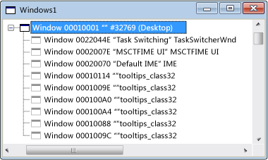

# Windows View
When you first open Spy++, Windows view displays a tree of all windows and controls in the system. The window handle and class name are shown. The current desktop window is at the top of the tree. All other windows are children of the desktop, and are listed according to the standard window hierarchy. Sibling windows appear in expansible lists indented below their parents.  
  
 The figure below shows a typical Spy++ Windows view with the top node expanded.  
  
   
Spy++ Windows View  
  
 The current desktop window is at the top of the tree. All other windows are children of the desktop, and are listed according to the standard window hierarchy, with sibling windows ordered by Z-order. You can expand or collapse any parent node of the tree by clicking the + or - symbol next to the node.  
  
 When Windows view has the focus, you can use the Finder tool in the [Window Search Dialog Box](../vs140/Window-Search-Dialog-Box.md) to display information from any window open on your system.  
  
## In This Section  
 [How to: Use the Finder Tool](../vs140/How-to--Use-the-Finder-Tool.md)  
 Shows how this tool scans windows for properties or messages.  
  
 [How to: Search for a Window in Windows View](../vs140/How-to--Search-for-a-Window-in-Windows-View.md)  
 Explains how to find a specific window in Windows view.  
  
 [How to: Display Window Properties](../vs140/How-to--Display-Window-Properties.md) m  
 Procedures for opening the Window Properties dialog box.  
  
## Related Sections  
 [Spy++ Views](../vs140/Spy---Views.md)  
 Explains the Spy++ tree views of windows, messages, processes, and threads.  
  
 [Using Spy++](../vs140/Using-Spy--.md)  
 Introduces the Spy++ tool and explains how it can be used.  
  
 [Find Window Dialog Box](../vs140/Find-Window-Dialog-Box.md)  
 Used to view the properties or messages from a specific window.  
  
 [Window Search Dialog Box](../vs140/Window-Search-Dialog-Box.md)  
 Used to find the node for a specific window in Windows view.  
  
 [Window Properties Dialog Box](../vs140/Window-Properties-Dialog-Box.md)  
 Used to display the properties of a window selected in Windows view.  
  
 [Spy++ Reference](../vs140/Spy---Reference.md)  
 Includes sections describing each Spy++ menu and dialog box.