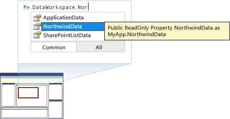

# Working with Data-Related Objects in Code
LightSwitch generates objects and members that describe your data. The names of these objects and members match the names of items in your solution. For example, if you add a table named `Customer`, LightSwitch generates an object named `Customer`. This topic describes each type of object that is generated by LightSwitch. To view code examples that use these objects and members to perform common data-related tasks, see [Performing Data-Related Tasks by Using the Object Model](../vs140/Performing-Data-Related-Tasks-by-Using-Code.md).  
  
## Hierarchy of Generated Objects and Members  
 The following illustration summarizes the generated objects and members of your data model.  
  
   
  
## Application  
 The `Application` object provides top level access to objects in your application. To access the `Application` object, open any user code file in the code editor, and then type `Application`. The types of methods and properties that appear in IntelliSense after you type `Application` and then type “.” will change based on the code file in which you are writing code. In most cases, you can use a property of the `Application` object to get an object that represents the current user.  
  
##   Data Workspace  
 The `DataWorkspace` object is the top-level object for all data access. The `DataWorkspace` object contains a property for each data source in your project. For example, if you have a data source named NorthwindData, LightSwitch generates a property named `NorthwinddData`. When you type `DataWorkspace` in the Code Editor, the `NorthwindData` property becomes available in a drop-down list.  
  
 The following illustration shows some generated members that might appear in a drop-down list.  
  
   
  
## Data Source  
 LightSwitch generates an object for each data source in your project. This object contains members that you can use to access data. The members of a data source object include entity set properties and query methods.  
  
 The following illustration shows some generated members that might appear in a drop-down list.  
  
   
  
###   Entity Set Properties  
 An entity set property returns a collection of entities. LightSwitch generates an entity set property for each entity in the data source. For example, if your data source contains an entity named `Customer`, LightSwitch generates a property named `Customers`. You could use the `Customers` property to get an `EntitySet` object that represents a collection of `Customer` entities.  
  
 The `EntitySet` object also contains members that enable you to check whether the current user has permission to read, update, or delete entities in the collection. For more information, see [Performing Data-Related Tasks by Using Code](../vs140/Performing-Data-Related-Tasks-by-Using-Code.md).  
  
> [!NOTE]
>  `EntitySet` is one of several types of entity collection objects. To optimize the performance of your code, make sure that you use the correct type of entity collection object for the type of business logic that you are writing. For more information, see [Entity Collection Objects and Performance](#EntityCollectionObjects).  
  
###   Query Methods  
 A query method gets the results of a query. LightSwitch generates a method for each query that is defined in your data source. The name of the method matches the name of the query.  A query can return a single entity, or a collection of entities of type `IDataServiceQueryable`.  
  
> [!NOTE]
>  `IDataServiceQueryable<T>` is one of several types of entity collection objects. To optimize the performance of your code, make sure that you use the correct type of entity collection object for the type of business logic that you are writing. For more information, see [Entity Collection Objects and Performance](#EntityCollectionObjects).  
  
 By default, LightSwitch generates the following query methods for each entity in the data source.  
  
1.  *<Entity Name\>*_Single.  
  
2.  *<Entity Name\>*_SingleOrDefault.  
  
 Both of these methods accept a primary key segment and return a single entity object. If no entities are returned, the *<Entity Name\>*_Single method throws an exception whereas the *<Entity Name\>*_SingleOrDefault method returns a `Null` value (`Nothing` in Visual Basic).  
  
##   Entities  
 LightSwitch generates an `EntityObject` for each entity in an entity collection. For example, if your code retrieved a collection of orders, the collection would contain an `EntityObject` that represents each order. An `EntityObject` contains members that you can use to delete an entity, read or update the value of entity properties, or get related entities. You can get an `EntityObject` from an entity collection object such as an `EntitySet` or by calling a query method that returns an entity. For more information, see [Performing Data-Related Tasks by Using the Object Model](../vs140/Performing-Data-Related-Tasks-by-Using-Code.md).  
  
 The following illustration shows the members of an `Order` entity named `myOrder`. The `Order` entity contains entity properties such as `OrderDate`, `OrderID`, and `Freight`. The `Order` entity also has members that you can use to get the related `Order_Details` collection and the `Customer` who placed the order.  
  
   
  
 In this example, the `Customer` property returns a `Customer` entity. A `Customer` entity is on the one side of the `Customer-Order` relationship.  
  
 The `Order_Details` property returns a collection of `Order_Details` entities. The `Order_Details` entity is on the many side of the `Order-Order_Details` relationship. The `Order_Details` collection object is of type `EntityCollection`.  
  
 This illustration also shows a property named `Order_DetailsQuery`. Properties that end in the with the word `Query` return an `IDataServiceQueryable` object.  
  
> [!NOTE]
>  `EntityCollection` and `IDataServiceQueryable` are both types of entity collection objects. To optimize the performance of your code, make sure that you use the correct type of entity collection object for the type of business logic that you are writing. For more information, see [Entity Collection Objects and Performance](#EntityCollectionObjects).  
  
##   Entity Collection Objects and Performance  
 When you use an entity collection object in a LINQ expression, LightSwitch performs an operation that retrieves entities from the server tier.  The type of object that you use determines whether LightSwitch retrieves all of the entities in a collection or only a subset of them. To ensure that your code performs as expected,   choose the most appropriate type of collection object for the business logic that you are writing. There two types of entity collection objects: Objects that cause LightSwitch  to evaluate a LINQ expression remotely, and objects that cause LightSwitch  to evaluate a LINQ expression locally.  
  
### LINQ Operations: Remote vs. Local Execution  
 If you use an `EntitySet` or `IDataServiceQueryable` object in a LINQ expression, LightSwitch passes the entire LINQ expression to the data service of the server tier. Then, the results of the expression are passed back to the calling code. This type of query execution performs well because only entities that satisfy the query are returned to the calling code. However, only a subset of query operators is supported by the data service. If your expression requires other LINQ operators, consider using other types of collection objects.  
  
 The following illustration shows a LINQ expression that uses an `IDataServiceQueryable` object. This example shows the LINQ operation passing the entire expression to the data service and returning only `Order` entities that satisfy the conditions of the query.  
  
   
  
 If you use an `EntityCollection` or `IEnumerable` object in a LINQ expression, LightSwitch  does not pass the expression to the data service. Instead, LightSwitch  retrieves all entities of the given type. Then, the expression is applied to the entire collection locally.  If an entity collection is large, this type of query execution can negatively affect performance. However, your code can use the full set of LINQ operators.  In addition, this approach might make sense when you want to pass the full collection entities to other methods in your code.  
  
 The following illustration shows a LINQ expression that uses an `EntityCollection` object. This example shows the LINQ operation retrieving all `Order` entities for a particular customer. Then, the conditions of the query are applied to the entire collection locally.  
  
   
  
### Examples: Getting Entity Collection Objects in Code  
 The following shows how you can get collections of `Order` entities in the Northwind sample database.  
  
|To get this entity collection object|Use this code|Remote or Local Execution|  
|------------------------------------------|-------------------|-------------------------------|  
|`EntitySet`|`DataWorkspace.Northwind.Orders`   or   `myOrder.Details.EntitySet()`|Remote|  
|`IDataServiceQueryable`|`myCustomer.OrdersQuery`   or   `DataWorkspace.Northwind.Orders.GetQuery()`|Remote|  
|`EntityCollection`|`myCustomer.Orders`|Local|  
|`IEnumerable`|`myCustomer.OrdersQuery.Execute()`   or   `DataWorkspace.Northwind.Orders.GetQuery().Execute()`|Remote|  
  
## See Also  
 [Data and Entities: The Information Behind Your Application](../vs140/Data--The-Information-Behind-Your-Application.md)   
 [Performing Data-Related Tasks by Using Code](../vs140/Performing-Data-Related-Tasks-by-Using-Code.md)