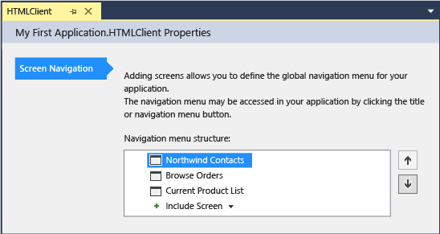

# Working with Menus in a LightSwitch Application
This lesson shows how to change the global navigation menu in a LightSwitch application.  
  
## Customizing Menus  
 When an application runs, the navigation menu lists screens that  the user can display. You can add or remove menu items, change the menu text, and change the order in which items appear.  
  
#### To add or remove a menu item  
  
1.  In **Solution Explorer**, open the shortcut menu for the **Screens** node, and then choose **Edit Screen Navigation**.  
  
     The HTML Client designer opens.  
  
       
  
2.  In the  **Navigation menu structure** list, open the shortcut menu for the **Current Product List** node, and then choose **Delete**.  
  
     The **Current Product List** menu item disappears from the navigation menu.  
  
3.  Open the **Include Screen** list and choose **Current Product List**.  
  
     The **Current Product List** menu item appears at the bottom of the **Navigation menu structure** list.  
  
#### To change menu text  
  
1.  Open the shortcut menu for the **Northwind Contacts** node, choose **Rename**, and then enter `Contacts`.  
  
2.  Repeat step 1 to rename the **Current Product List** node as `Products`.  
  
#### To reorder menu items  
  
1.  Choose the **Products** node.  
  
2.  In the right margin of the designer, choose the **Move up** button.  
  
     The **Products** menu item is moved above the **Browse Orders** menu item.  
  
3.  Run the application and verify the changes to the navigation menu.  
  
## Closer Look  
 The **Include Screen** list also contains screens that are already on the navigation menu. If you add a second menu item for a screen, you’ll get duplicate menu items because both items open the same instance of the screen.  
  
 Renaming a menu item affects only the name that appears in the running application. The actual screen name remains unchanged.  
  
## Next Steps  
 In the next lesson, you’ll learn how to change which screen appears first when the application starts.  
  
 Next lesson: [Setting the Startup Screen](../vs140/Setting-the-Startup-Screen-for-a-LightSwitch-Application.md)  
  
## See Also  
 [Creating Menus and Commands](../vs140/Creating-Commands-and-Working-with-Menus-in-LightSwitch.md)   
 [How to: Create a Navigation Menu in a LightSwitch HTML Client App](../vs140/How-to--Create-a-Navigation-Menu-in-a-LightSwitch-HTML-Client-App.md)