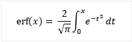

# erf, erff, erfl, erfc, erfcf, erfcl
Computes the error function or the complementary error function of a value.  
  
## Syntax  
  
```  
double erf(  
   double x  
);  
float erf(  
   float x  
); // C++ only  
long double erf(  
   long double x  
); // C++ only  
float erff(  
   float x  
);  
long double erfl(  
   long double x  
);  
double erfc(  
   double x  
);  
float erfc(  
   float x  
); // C++ only  
long double erfc(  
   long double x  
); // C++ only  
float erfcf(  
   float x  
);  
long double erfcl(  
   long double x  
);  
```  
  
#### Parameters  
 `x`  
 A floating-point value.  
  
## Return Value  
 The `erf` functions return the Gauss error function of `x`. The `erfc` functions return the complementary Gauss error function of `x`.  
  
## Remarks  
 The `erf` functions calculate the Gauss error function of x, which is defined as:  
  
   
  
 The complementary Gauss error function is defined as 1 – erf(x). The `erf` functions return a value in the range -1.0 to 1.0. There is no error return. The `erfc` functions return a value in the range 0 to 2. If `x` is too large for `erfc`, the `errno` variable is set to `ERANGE`.  
  
 Because C++ allows overloading, you can call overloads of `erf` and `erfc` that take and return `float` and `long double` types. In a C program, `erf` and `erfc` always take and return a `double`.  
  
## Requirements  
  
|Function|Required header|  
|--------------|---------------------|  
|`erf`, `erff`, `erfl`, `erfc`, `erfcf`, `erfcl`|<math.h>|  
  
 For additional compatibility information, see [Compatibility](../vs140/Compatibility.md).  
  
## .NET Framework Equivalent  
 Not applicable. To call the standard C function, use `PInvoke`. For more information, see [Platform Invoke Examples](assetId:///15926806-f0b7-487e-93a6-4e9367ec689f).  
  
## See Also  
 [Floating-Point Support](../vs140/Floating-Point-Support.md)